Jamas me había tenido la oportunidad de trabajar con madera de balsa, aunque  desde hace tiempo tenía la curiosidad de hacerlo, así que decidí construir su "avión rojo".

<aside>
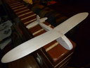    
</aside>


## Buscando los modelos


El primer paso fue buscar el modelo que me serviría de guiá en el proceso. No fue difícil encontrar una gran cantidad de modelos en Internet. En  el sitio www.e-aeromodelismo.com.ar encontré mucha variedad de modelos  de aviones para madera balsa. De todos los que pude revisar me quede con el modelo llamado [Escolar](http://192.168.0.104/personalweb/archivos/Escolar.gif) por parecerse un poco al avión deseado.

<aside>
[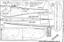](../../images/gabyprojects/Escolar.gif)    
</aside>


## Comprando los Materiales


El siguiente paso fue comprar una lamina de madera balsa de 4mm que me  costo 65Bs, después me dí cuenta que este ancho era demasiado. Esto  afectó especialmente el proceso de doblar las alas para darle la  curvatura requerida en el punto de contacto con el cuerpo del avión.  Otro material fue la pintura roja no toxica, como la utilizada en  preescolar, para que pueda ser manipulada por la niña sin problemas. Por ultimo, una hojilla exacto para cortar la madera, un clip y un cordel  que luego veremos su utilidad.


## Construyendo el avión


Para aprovechar la madera, tuve que escalar la imagen e imprimirla en dos hojas de tamaño carta (lo pueden descargar aquí: [1](http://192.168.0.104/personalweb/archivos/Escolar1.pdf) y [2](http://192.168.0.104/personalweb/archivos/Escolar2.pdf)), que luego de recortar las piezas, me sirvieron de guiá para marcarlas  sobre la madera. Después vino el proceso de cortar la madera. En este  punto hay que tener mucho cuidado de no arrastrar el exacto para evitar  que la madera rompa. Aquí podemos ver las piezas en este proceso.

<aside>
[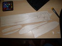](../../images/gabyprojects/avion_P1030472.JPG)    
</aside>    


Las piezas interiores de cuerpo del avión se dibujaron de manera que solo  ocuparan un pequeño espacio interior, para hacer que el avión sea hueco  por dentro y así, hacerlo más liviano. También coloque un pequeño aro  con el clip en la parte interior trasera del avión, para el caso en que  desee incorporar una hélice que funcione con una elástica interna. Una  vez pegado todo el cuerpo procedí a lijarlo, así como las alas. Hay que  tener cuidado en esta etapa para evitar reducir demasiado en los  bordes,sin embargo las alas se deben perfilar más delgadas en la parte  trasera que en la delantera. Un punto de atención aquí es que se debe  tratar de rebajar principalmente por la parte superior.

<aside>
[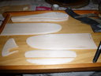](../../images/gabyprojects/avion_P1030493.JPG)    
</aside>


Para lograr la curvatura de las alas en los bordes de contacto utilice la  siguiente técnica (que también vi por aquí): se humedece la madera con  jabón para vidrio, hasta que queda flexible. Luego se deja secar con la  curvatura que se desea. Esto lo logré con una pelota en la parte  inferior del ala y sujetada con una liga elástica fuerte. Después de  tener todas la piezas de las alas terminadas, queda pegar. Utilice una  pega de las que utilizan en preescolar para evitar el fuerte olor. 

<aside>
[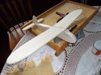](../../images/gabyprojects/avion_P1030505.JPG)    
</aside>


Aquí podemos ver algunas imágenes de como quedó nuestro avion antes de pintarlo, mientras se secaba la pega:

| [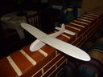](../../images/gabyprojects/avion_P1030529.JPG) | [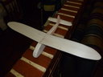](../../images/gabyprojects/avion_P1030530.JPG) | [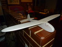](../../images/gabyprojects/avion_P1030531.JPG) |
| ------------------------------------------------------------ | ------------------------------------------------------------ | ------------------------------------------------------------ |
| [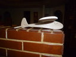](../../images/gabyprojects/avion_P1030532.JPG) | [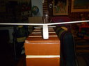](../../images/gabyprojects/avion_P1030533.JPG) | [](../../images/gabyprojects/avion_P1030534.JPG) |


Por ultimo viene la etapa del pintado. Escogimos una pintura al frio de  color color rojo suave. Tal vez sea mejor idea escoger una pintura  acrílica para proteger el avión del agua o la humedad.

| [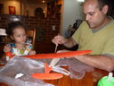](../../images/gabyprojects/avion_P1030549.JPG) | [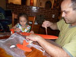](../../images/gabyprojects/avion_P1030546.JPG) |
| ------------------------------------------------------------ | ------------------------------------------------------------ |
|                                                              |                                                              |


## Jugando con el avión.


Uno de los problemas que se me presentaron fue como evitar que el avión se  dañe al caer o como enseñas a Gabriela a lanzarlo. La solución fue  amarrarle una cuerda para volarlo en círculos. Le coloque al avión un  clip en la base para evitar el roce con la madera cuando aterriza. 

<aside>
[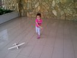](../../images/gabyprojects/avion_IMG-20130921-00017.jpg)    
</aside>


Aquí, agunas fotos de como utilizamos el cordel para jugar con el avión: 


| [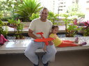](../../images/gabyprojects/avion_P1030625.JPG) | [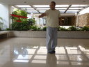](../../images/gabyprojects/avion_P1030595.JPG) | [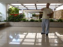](../../images/gabyprojects/avion_P1030601.JPG) |
| ------------------------------------------------------------ | ------------------------------------------------------------ | ------------------------------------------------------------ |
| [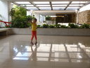](../../images/gabyprojects/avion_P1030576.JPG) | [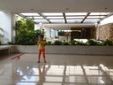](../../images/gabyprojects/avion_P1030585.JPG) | [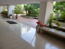](../../images/gabyprojects/avion_P1030704.JPG) |


Y aquí algunos [videos](http://www.youtube.com/embed/aD1_e4rPsvM?rel=0&amp;fs=1&amp;wmode=transparent): 


Opción 1:
<iframe src="http://www.youtube.com/embed/aD1_e4rPsvM?rel=0&amp;fs=1&amp;wmode=transparent" width="400" height="300" frameborder="0" allowfullscreen title="JoomlaWorks AllVideos Player"></iframe>	


Opción 2:
[](https://www.youtube.com/watch?v=nTaC5yfWkS0)


Opción 3:
<div class="embed-container">
  <iframe
      src="https://www.youtube.com/embed/w09pRK1DXy4"
      width="700"
      height="480"
      frameborder="0"
      allowfullscreen="">
  </iframe>
</div>


Opción 4:
<iframe width="560" height="315" src="https://www.youtube.com/embed/oFroXMK37WQ" frameborder="0" allow="accelerometer; autoplay; encrypted-media; gyroscope; picture-in-picture" allowfullscreen></iframe>


Opción 5:
```{r}
library("vembedr")
embed_url("https://www.youtube.com/watch?v=aD1_e4rPsvM")
```


Aquí hay más:

1. [Aquíintento enseñarle como hacer volar el avión con el cordel.](http://www.youtube.com/watch?v=aD1_e4rPsvM)
2. [Gabriela junado con el avión](http://www.youtube.com/watch?v=nTaC5yfWkS0).
3. [Otro video de Gabriela jugando con el avión](http://www.youtube.com/watch?v=w09pRK1DXy4).
4. [Este video](http://www.youtube.com/watch?v=oFroXMK37WQ) marea un poco, intentaba grabar desde la perspectiva del que lo vuela.