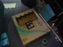
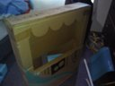
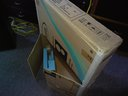
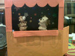
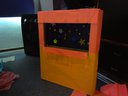
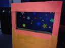
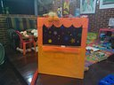
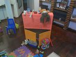
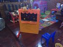

## Construcción del teatrino.

Para construirlo usé una caja de cartón de un televisor, más o menos así:

|  |  |  |
| ------------------------------------------------------------ | ------------------------------------------------------------ | ------------------------------------------------------------ |
|                                                              |                                                              |                                                              |

 
Aquí dejo algunas imágenes de como quedo el teatrino:

|  |  |  |
| ------------------------------------------------------------ | ------------------------------------------------------------ | ------------------------------------------------------------ |
|  |  |  |

## El impacto de los títeres  

El efecto de de la interacción con títeres es impresionante. A pesar de  saber que se trata de un juguete que esta siendo manejado por su papá,  Gaby estableció una relación directa y abierta con ellos. La primera vez que usamos el teatrino me pidió que usara cada par de títeres de los  que disponíamos para presentarse y mostrarles todos sus juguetes. En una siguiente oportunidad les mostró su uniforme de ballet e incluso les  contaba como se sentía y como se había divertido en su clase. Hasta  entonces nunca me había percatado del poder de los títeres para que los  niños se abran y cuenten sobre sus emociones.

