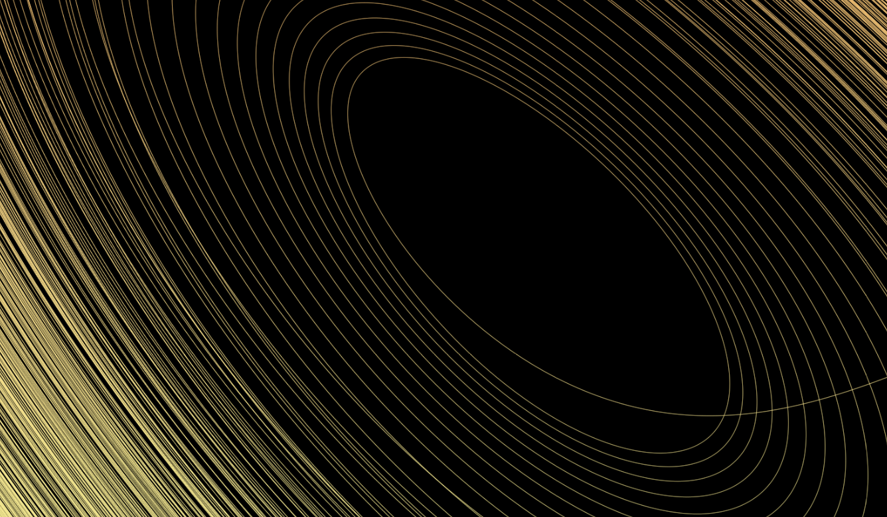
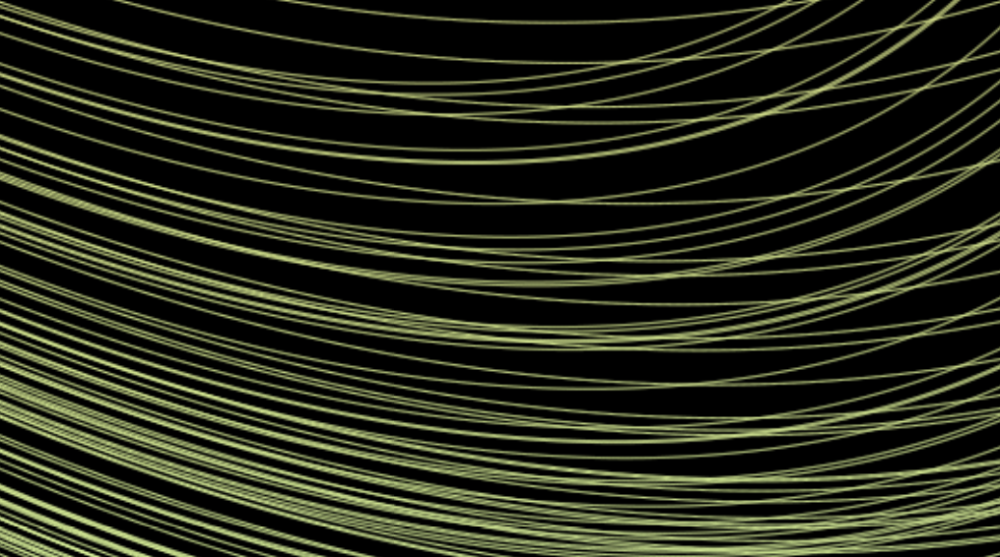

```{r setup, include=FALSE}
knitr::opts_chunk$set(echo = FALSE)
```

En 1963 el matemático y meteorólogo [Eduard N. Lorenz](https://es.wikipedia.org/wiki/Edward_Lorenz) estaba experimentando con unas ecuaciones diferenciales ordinarias en un intento por simular una versión simplificada de una dinámica del clima. 
$$
\begin{aligned}
\dot{x} & = \sigma(y-x) \\
\dot{y} & = x(\rho - z) - y \\
\dot{z} & = xy -\beta z
\end{aligned}
$$
En medio de la simulación, cuyos resultados se tenían que imprimir porque no se podían guardar en disco por esa época, se fue la luz. Una vez reestablecido el sistema, decidió continuar con la simulación pero no comenzando desde el principio, sino que tomó las condiciones iniciales en un punto intermedio de la secuencia que ya había creado. De esa forma ahorraría papel, tiempo y podría verificar que el sistema evolucionaría de la misma manera que lo había hecho antes. Sin embargo esto que parecía obvio, no ocurrió. Al cabo de un tiempo las secuencias original y la nueva comenzaron a separarse, y mucho.
Se hicieron pruebas para intentar descubrir donde estaba el error, pero el hecho es que tanto el primer cálculo como el segundo seguían perfectamente las [ecuaciones](https://en.wikipedia.org/wiki/Lorenz_system). El análisis gráfico mostró lo que realmente estaba ocurriendo:


- Sin importar las condiciones iniciales que se escojan el resultado es el mismo 
- Las tres variables, juntas en un gráfico de tres dimensiones, siempre tenderán a formar la figura de un atractor extraño de dos discos en 3D, que ahora conocemos como el [atractor de Lorenz](https://es.wikipedia.org/wiki/Atractor_de_Lorenz),
- Sin embargo, estas trayectorias no son cíclicas, ya que estos caminos nunca se repiten.
- Por muy parecidas que sean dos trayectorias, estas tenderán a separarse radicalmente tarde o temprano, de hecho
- basta una mínima diferencia "infinitesimal" entre lo dos caminos para que esto ocurra, que fue justamente lo que pasó en el experimento original, donde la variación estuvo en el orden de los decimales que no se pudieron imprimir.

Inspirado en la forma de este [atractor extraño](https://es.wikipedia.org/wiki/Atractor), Lorenz le dio nombre al famoso postulado de la [teoría del caos]([https://es.wikipedia.org/wiki/Teor%C3%ADa_del_caos](https://es.wikipedia.org/wiki/Teoría_del_caos)): "[El efecto mariposa](https://es.wikipedia.org/wiki/Efecto_mariposa) que dice que hasta el aleteo de una mariposa podría desencadenar eventos catastróficos en otra arte del mundo, como una poderosa tormenta. 



Esta imagen muestra como las trayectorias forman una patrón pero sin llegar a tocarse. Las líneas tienen el ancho de un pixel con anti-alising para maximizar el detalle en la versión impresa.



En esta imagen de detalle del atractor se observan trayectorias que parecen venir juntas y comienzan a separarse, algunas continúan en el mismo disco y otras pasan al otro.

Es impresionante ver como esta complejidad pueda surgir de ecuaciones tan simples. Nos hace pensar que muchos fenómenos de la naturaleza aparentemente aleatorios pudieran ser caóticos, es decir, regidos por reglas matemáticas, y de ser así, sería más impactante aún, tener que aceptar que aunque conociéramos las ecuaciones que rigen a la naturaleza o el universo, no podríamos usarlas para predecir el futuro, ya que tendríamos que poder medir con infinita precisión el valor de las variables involucradas.

El aparente desorden o aleatoriedad de los sistemas caóticos, es en realidad orden, tan exacto y matemático como impredecible e inexplicable.
