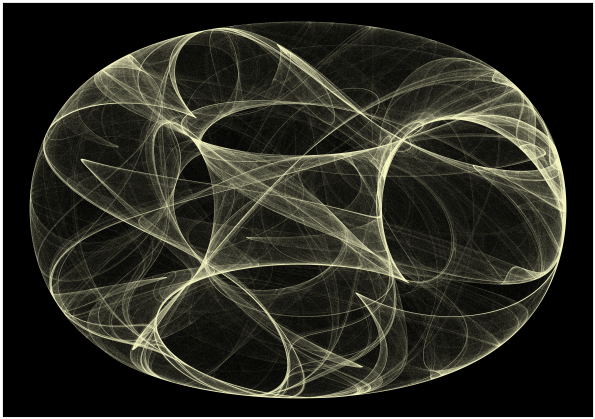

```{r setup, include=FALSE}
knitr::opts_chunk$set(echo = FALSE)
```

Un factor común de la mayoría de los fractales, es su poder de atraernos, de casi hipnotizarnos por su particular belleza, tal como si fueran verdaderas obras de arte. Los atractores de Clifford son un ejemplo del arte que puede representar el movimiento de los sistemas caóticos.


## Péndulo Caótico

<aside>

</aside>

Recordando el efecto mariposa, el péndulo doble es uno de los sistemas caóticos más simples. Si se lanza, dando posiciones iniciales ligeramente diferentes cada vez, se obtienen trayectorias completamente distintas.

## Atractores de Clifford

Otras dinámicas inspiradas en este tipo de sistemas son las que generan los [atractores de Clifford](http://paulbourke.net/fractals/clifford/):
$$
x_{n+1} = sin (a~y_n ) + c~cos (a~x_n ) \\
y_{n+1} = sin (b~x_n ) + d~cos (b~y_n )
$$


Con solo variar los parámetros a,b,c, y d es posible obtener una infinidad de atractores de increíble rareza y particular belleza, casi cómo si fueran verdaderas obras de arte. Haciendo algunas simulaciones en las que dibujamos las trayectorias con un poco de transparencia, es fácil notar que para ciertos parámetros,  

|Atractor de Clifford | 
| :---: |
|  |

- se obtienen estructuras en las que las trayectorias tienden a cubrir todo el espacio de posibilidades, sin embargo la distribución no es uniforme.
- Algunas trayectorias son mas probables que otras. Lo que se puede observar por la intensidad de esos trazos, gracias a ellas
-  se generan imágenes que aparentan tener volumen tridimensional, a pesar de estar definidas y construidas y en 2 dimensiones.

[Clifford Alan Pickover](https://en.wikipedia.org/wiki/Clifford_A._Pickover)  es un científico que dedicó gran parte de su vida a la divulgación de la ciencia,  la [visualización científica](https://en.wikipedia.org/wiki/Scientific_visualization) , al [arte computacional](https://en.wikipedia.org/wiki/Computer_art) y a las [matemáticas recreativas](https://en.wikipedia.org/wiki/Recreational_mathematics). En sus propias palabras, planteó que "los datos ... proliferan a un ritmo increíble, si los humanos intentan leer dichos datos en forma de números y letras, tomarán la información al ritmo de un caracol. Sin embargo, si la información se presenta gráficamente, los analistas humanos pueden asimilarla y obtener información mucho más rápido"[1](Visualizing Biological Information,1995).  En muchos sentidos, sus trabajos funcionaron para impulsar el "el arte y la ciencia de hacer visibles los trabajos invisibles de la naturaleza"[2](Frontiers of Scientific Visualization, 1994).

