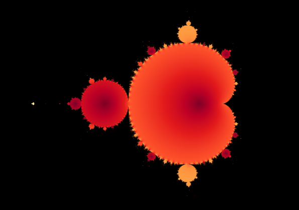

```{r setup, include=FALSE}
knitr::opts_chunk$set(echo = FALSE)
```

¿Cuánto mide la costa de Gran Bretaña? Parece una pregunta simple, pero su respuesta sorprendió a [Benoît B. Mandelbrot]([https://es.wikipedia.org/wiki/Beno%C3%AEt_Mandelbrot](https://es.wikipedia.org/wiki/Benoît_Mandelbrot)): depende de cuán cerca se mire, "aquí hay una pregunta, un elemento básico de la geometría de la escuela primaria que, si lo piensas, es imposible" - dijo - "la longitud de la costa, en cierto sentido, es infinita"[1]().

Veámoslo de la siguiente forma, pareciera sencillo medir la longitud en un mapa, pero si nos acercamos a ver con mayor detalle, descubriremos que no tomamos en cuenta muchos dobleces y cuencas, es decir que en realidad la distancia es un poco mayor de lo que creíamos. Pues bien, este efecto se repetirá siempre que veamos el mapa con mayor detalle, y es precisamente lo que ocurre con muchos objetos de la naturaleza, como las montañas, las nubes y en las matemáticas, cómo lo descubrió Mandelbrot con el [conjunto](https://es.wikipedia.org/wiki/Conjunto_de_Mandelbrot) que ahora lleva su nombre: 



Este objeto formado por todos los valores de condiciones iniciales para los cuales una determinada dinámica converge, nos muestra el infinito detalle que separa los valores que nos llevan a la convergencia, de aquellos que la hacen divergir:
$$
z_{n+1}=z_n^2+c
$$
Sorprende cómo una dinámica tan simple pueda generar una imagen tan fascinante, que muestra propiedades tan extrañas como la auto-similitud, vemos como  las mismas formas se repiten y reaparecen a diferentes escalas. 

La aparente contradicción entre la longitud del conjunto y su infinito detalle se resolvió con una sorprendente idea: este objeto no está en 2 dimensiones, evidentemente tampoco en 3, sino que pertenece a algún punto entre la 2da y 3ra dimensión, es decir, que pertenece a una dimensión fraccionaria o dimensión fractal, y de aquí, el por qué objetos como este adoptaron el nombre de [**Fractales**](https://en.wikipedia.org/wiki/Fractal). Piénsenlo bien, un perímetro o distancia es una medida unidimensional, calculada sobre un mapa (bidimensional), sin embargo, este objeto tiene un poco más de dos dimensiones por eso es imposible calcular su perímetro de manera exacta.

¿Cuando y por qué algunas dinámicas matemáticas convergen mientras otras divergen?, o más aún ¿porque algunas dinámicas convergen bajo ciertas condiciones iniciales y divergen en otras? Como ven, la respuestas pueden llegar a ser más complejas de lo que pensábamos. Cuando estamos cerca del borde del conjunto, un punto podría converger mientras que otro infinitesimalmente cercano podría no hacerlo, en esta región se comporta como un sistema caótico. 

Estas son preguntas importantes cuando, por ejemplo, trabajamos en el entrenamiento de modelos de inteligencia artificial, en los cuales solemos usar algoritmos de entrenamiento o dinámicas como el descenso del gradiente. Esto respondería cuestiones como el por qué algunos sistemas tienen la capacidad de "aprender" mientras que otros no. O visto de otra forma, cómo diseñar sistemas de aprendizaje automático cuya dinámica de entrenamiento nos garantice la convergencia, es decir, aprender.

