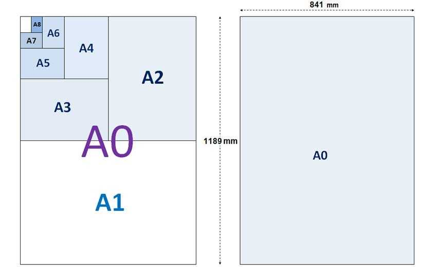

```{r setup, include=FALSE}
knitr::opts_chunk$set(echo = FALSE)
```

Aproveché unos días de mis vacaciones para preparar algunas gráficas en R, que quería hacer desde hace tiempo para adornar mi estudio. Se trata de fractales y atractores extraños, pero quería hacerlos de forma de poder imprimirlos en formato grande, como afiches. La idea era no tener que escalar las imágenes para imprimirlas en formatos grandes, sino que en vez de eso, estuvieran elaboradas pixel a pixel para estos formatos como el A1 (23.4 x 33.1 in) a 300dpi o el A2 (16.5 x 23.4 in) a 600dpi.

He aquí algunos resultados:

|                    Conjunto de Mandelbrot                    |                      Atractor de Lorenz                      |                     Atractor de Clifford                     |
| :----------------------------------------------------------: | :----------------------------------------------------------: | :----------------------------------------------------------: |
|  |  |  |
|                         Breve reseña                         |                         Breve reseña                         |                         Breve reseña                         |
|                  Imagen de alta resolución                   |                  Imagen de alta resolución                   |                  Imagen de alta resolución                   |
|                        Código fuente                         |                        Código fuente                         |                        Código fuente                         |

Pongo a la disposición estas imágenes en alta resolución para su libre descarga, bajo licencia Creative Commons, así como los enlaces a los repositorios de código fuente para regenerarlas o modificarlas. En un próximo post estaré publicando un tutorial explicando como construir este tipo de gráficas con R, así como algunas reseñas donde expongo, desde mi punto de vista, del por qué son de tanto interés.


## Gráficas en gran formato con R

El reto de crear imágenes de fractales o atractores extraños de gran formato implica resolver varios asuntos, entre ellos están:

- Algoritmos de construcción.
- Estructuras de datos.
- Procesamiento y optimización. 
- Dimensiones y formato de la imagen.
- El problema del Alising.
- Layout de impresión.

### Algoritmos de construcción

La mayoría de los fractales o atractores extraños se construyen a partir de la definición y simulación de alguna dinámica, por ejemplo
$$
X_{n+1}=F(X_n)
$$
 con cual, se construyen secuencias de valores para el vector _X_ , a partir de un valor inicial o condición inicial para dicho sistema, para esto y se pueden utilizar varias estrategias:

- Diagramas de fase: consiste en la proyección de las trayectorias construidas con las variables de estado juntas en el espacio n-dimensional hacia un plano 2D. 
- Escala de valores de convergencia, que consiste en recorrer una sección del espacio de posibles valores iniciales y representar en una escala de colores a los que llevan a la dinámica a converger, tomando colores según el valor de convergencia.
- Tiempo de escape, consiste en en recorrer una sección del espacio de posibles condiciones iniciales y seleccionando aquellas que producen la divergencia de la dinámica, pero tomando como valor de referencia para la selección del color, la cantidad de iteraciones que requirieron para alcanzar cierto umbral, como una especie de medida de velocidad de escape.
- Cualquier otro método creativo que se nos ocurra.   

### Estructuras de datos

Las estructuras de datos para construir estas gráficas son simples, el verdadero problema es contar con la memoria RAM suficiente para almacenar series de 20 millones de registros para cada una de las variables del vector de estados, o matrices en el orden de 10.000x10.000, es decir 100 millones de puntos o más 

### Procesamiento optimización

Para lograr un algoritmo capaz de construir nuestras imágenes debemos pensar en la eficiencia, en la medida de lo posible ejecutar procesos de calculo vectoriales o recurrir a sub-procesos en C/C++ con la ayuda del paquete _rcpp_.

### Dimensiones y formato de la imagen

Cómo comentamos al comienzo, la idea principal es generar imágenes que no requieran ser escaladas o reducidas al momento de la impresión, es decir que tengan las dimensiones exactas en las cuales se verán. Recordemos que si una imagen es reducida, pierde información visual, mientras que si es agrandada, esta se pixelará. Por esta razón, primero que nada debemos decidir el tamaño impreso de nuestra gráfica. 

#### [Tabla de tamaños estándar de papel](https://www.officexpress.co.uk/paper-guide/)

| **Size** | **Width x Height (mm)** | **Width x Height (in)** |
| :------: | :---------------------: | :---------------------: |
|    A0    |      841 x 1189 mm      |     33.1 x 46.8 in      |
|    A1    |      594 x 841 mm       |     23.4 x 33.1 in      |
|    A2    |      420 x 594 mm       |     16.5 x 23.4 in      |
|    A3    |      297 x 420 mm       |     11.7 x 16.5 in      |
|    A4    |      210 x 297 mm       |      8.3 x 11.7 in      |
|    A5    |      148 x 210 mm       |      5.8 x 8.3 in       |
|    A6    |      105 x 148 mm       |       4.1 5.8 in        |
|    A7    |       74 x 105 mm       |      2.9 x 4.1 in       |
|    A8    |       52 x 74 mm        |      2.0 x 2.9 in       |
|    A9    |       37 x 52 mm        |      1.5 x 2.0 in       |
|   A10    |       26 x 37 mm        |      1.0 x 1.5 in       |

En R es posible graficar sobre dispositivos de despliegue distintos a la pantalla, en vez de esto podemos crear imágenes directamente en archivos con diversos formatos con funciones como [png()](https://www.rdocumentation.org/packages/grDevices/versions/3.4.1/topics/png), jpg(), tiff() o pdf(). Entre sus parámetros es posible especificar el tamaño del gráfico en diferentes unidades de medida ("cm", "mm" o "in"), así como la resolución en "dpi" (puntos por pulgada). En relación con el formato, la recomendación es usar el PNG, dado que JPEG optimiza la imagen reduciendo su tamaño pero perdiendo calidad. Por ejemplo para generar una imagen de tamaño A2 a 600dpi y en formato PNG, el código sería de la siguiente manera:


```R
png(filename="graphic.png", units="in", width=23.4, height=16.5, res=600)
	codigo de generación de la imagen aqui...
dev.off()
```

Le estamos indicando al dispositivo de salida que la grafica tendrá un tamaño de 23.4x16.5 pulgadas (A2) a una resolución de 600dpi. Esta misma imagen también se podría imprimir en un papel tamaño A1 pero si se reduce la resolución a 300dpi.

### Alising

En general, durante el proceso de generación del gráfico, cada pixel se calcula de manera exacta, sin embargo esto no es conveniente para los efectos estéticos, debido a efecto de alising, especialmente cuando lo que se despliega en la imagen son trayectorias o líneas. El Alising es el ese tipo de efecto de escalera que tienen la líneas cuando se dibujan de forma oblicua. 

Para reducir este problema se utiliza una técnica llamada anti-alising que consisten en dibujar los pixeles con cierto grado de transparencia dependiendo que tan cercanos están de la línea imaginaria central que podemos trazar en cualquier línea gráfica, haciendo que el trazo parezca suave en lugar de escalonado. Para esto se requiere acceder a las primitivas de despliegue gráfico del sistema operativo. No todos los sistemas soportan este tipo de primitivas, uno de ellos es GNOME con la librería de gráficos vectoriales llamada [cairo](https://en.wikipedia.org/wiki/Cairo_(graphics)). Por suerte, es posible incorporar su uso desde R a través del paquete "cairo", y luego incluyendo el parámetro "type" en la función png(): 


```R
install.packages("cairo")
library(cairo)
png(filename="graphic.png", units="in", width=23.4, height=16.5, res=600, type="cairo-png")
	codigo de generación de la imagen aqui...
dev.off()
```


### Layout de impresión

En muchos centros de impresión tienen el mismo precio, imprimir un pliego de tamaño A2 que uno de tamaño A0. En este caso es mucho más inteligente aprovechar todo el pliego A0, en el cual caben varias combinaciones (dos hojas A1, un A1 y dos A2 o cuatro A2). Para esto basta con ubicar nuestras imágenes en los tamaños y posiciones correctas.



Esta tarea suele ser sencilla, el tema es que si nuestras imágenes son muy pesadas podríamos tener problemas para cargar varias de ellas en un software de dibujo cualquiera. Mi recomendación es utilizar herramientas de transformación de gráficos raster en línea de comandos, estoy hablando específicamente de [imagemagick ](https://imagemagick.org/index.php), software libre que podemos instalar en cualquier sistema operativo. Esta herramienta incluye un comando llamado _convert_ que tiene entre su parámetros el _append_ y _rotate_, que podemos usar para disponer adecuadamente nuestras imágenes en un formato A0.

Por ejemplo si disponemos de 4 archivos de imágenes tamaño A2: clifford1.png y clifford2.png con orientación vertical, y dos imágenes lorenz1.png y mandelbrot1.png con orientación apaisada, 


podríamos usar el comando _convert_, para generar a partir de estos 4 archivos, uno solo en formato A0:

```bash
convert.exe +append clifford1.png Clifford2.png image01.png
convert.exe -append Mandelbrot1.png lorenz1.png image02.png
convert.exe -rotate 90 image02.png image03.png
convert.exe -append image01.png image03.png image04.png
```


