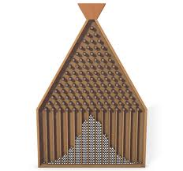

Aunque considero que el título de este video esta mal escogido, debido a que el caos no es desorden, sino orden. Este es un [video](http://www.youtube.com/watch?v=9xUBhhM4vbM) que me gusta mostrar a los estudiantes al comienzo del tema de variables aleatorias, porque ejemplifica bastante bien la connotación empírica de las funciones de probabilidad.

## Francis Galton

Sir [Francis Galton](http://es.wikipedia.org/wiki/Francis_Galton) (1822 - 1911) fue un antropólogo y geógrafo inglés. Estudió medicina en el hospital de Birmingham, en Londres y en Cambridge. Primo el gran Charles Darwin, que luego de muchos viajes se dedico a la investigación científica en el área de la geografía y la meteorología. Luego, inspirado por la publicación del *Origen de las especies*, se dedico en parte de su vida a teoría de la herencia y estadística demográfica.

## La "Máquina de Galton"


Este experimento consiste de una distribución de clavos o alfileres en forma triangular, de manera que al soltar un número de bolitas desde la cúspide de la estructura, caen chocando con estos alfileres. Cada bolita chocará con el primer clavo teniendo una probabilidad de 1/2 de ir hacía la izquierda o hacía la derecha, y así sucesivamente con los otros alfileres de los siguientes niveles. A lo largo de esta estructura, las bolitas toman caminos aleatorios hasta caer en alguno de los canales o bandejas colocadas en la base. El siguiente es un [video de la máquina de Galton](http://www.youtube.com/embed/9xUBhhM4vbM) en acción:

<aside>

</aside>

<iframe src="http://www.youtube.com/embed/M8t48Vpvl48?rel=0&amp;fs=1&amp;wmode=transparent" width="400" height="300" frameborder="0" allowfullscreen title="JoomlaWorks AllVideos Player"></iframe>


Al final, como se observa en el video, tendrán mayores probabilidades los canales interiores que los exteriores, formándose una distribución de probabilidades conocida como [Binomial](http://es.wikipedia.org/wiki/Distribución_binomial), que si el número de pelotas es suficientemente grande puede aproximarse por una distribución [Normal](http://es.wikipedia.org/wiki/Distribución_normal) o Gaussiana. Esta es justamente, la distribución que se encuentra dibujada sobre la máquina a modo de predicción de los resultados.

## Importancia de este experimento

Cuando nos enfrentamos a escenarios gobernados por el azar, como lo pueden ser muchas situaciones en economía, finanzas, opinión pública, redes sociales, marketing, etc. Generalmente sentimos que es como lanzar una moneda (50-50) y nuestra intuición nos dice que no podemos predecir lo que ocurrirá, por lo que no se puede tomar ninguna decisión fundamentada. Sin embargo, como se ha demostrado muchas veces, la estadística puede llegar a ser contra-intuitiva. 

Si bien no podemos predecir los resultados exactos, como lo sugiere la *Maquina de Galton*, muchos de estos escenarios siguen patrones. Conociendo estos patrones podemos hacer inferencias y tomar decisiones acertadas,  siempre que entendamos y manejemos adecuadamente los márgenes de error de nuestras predicciones.

## ¿Por qué ocurre esto?

Intuitivamente podemos ver que la trayectoria de cada bolita es una secuencia de "decisiones" entre ¿izquierda o derecha?, cuyas posibilidades se reducen a medida que nos acercamos a las bandejas de los extremos.  Tomemos por ejemplo la primera bandeja de la izquierda, para poder llegar a ella, una bolita tendría que tomar la misma decisión a lo largo de toda su trayectoria (izquierda, izquierda, izquierda,....) es decir que hay una sola forma o camino para llegar a esta bandeja. Por otro lado las bandejas del centro tienen muchos más caminos para llegar a ellas. Podemos suponer que la cantidad de bolitas que terminaran en cada bandeja, será proporcional a la cantidad de caminos posibles que hay para llegar a ellas.

**Nota:** *Si no estas interesado en la matemática o simulación computacional, puedes leer hasta aquí.*

## Formulación matemática

Supongamos que la pirámide de alfileres conta de $n$ niveles, es decir que esto corresponde las $n$ decisiones que debe tomar cada bolita para llegar a alguna bandeja, por lo tanto debe haber al final $n+1$ bandejas enumeradas desde el $0$ al $n$. 

Para representar las trayectorias de cada bolita, digamos que la decisión de ir por la izquierda es un 0 y la derecha es un 1, llamemos $D$ a la variable aleatoria Bernoulli que representa cada decisión:
$$
D=\left\{ \begin{array}{lcc}
             0 &   izquierda
             \\ 1 &  derecha
             \end{array}, luego ~ D \sim Bernoulli(p=1/2) 
   \right.
$$
Entonces cada trayectoria es independiente de las otras y se puede representar como un secuencia de $n$ decisiones independientes, a su vez:
$$
Trayectoria =\left\{d_1, d_2,...,d_n\right\}
$$
por ejemplo:
$$
Trayectoria =\left\{0, 1, 1, 0,...,1\right\}
$$
Es fácil notar que la bandeja final de una bolita corresponderá a las suma de las $n$ decisiones tomadas durante su trayectoria:
$$
Bandeja = \sum_{i=1}^n{d_i}
$$
Por ejemplo, como comentamos antes, si siempre se toma la decisión de ir por la izquierda, la bandeja final será el resultado de sumar $n$ ceros: 0, es decir la primera bandeja, así, si el caso fuera tomar siempre la derecha, la suma de las decisiones daría $n$ (la última de la derecha).

En este escenario podemos decir que la cantidad final de bolitas en cada bandeja será proporcional a la cantidad de trayectorias diferentes que llegan a ella, por lo tanto, para hallar una formulación matemática de la probabilidad de cada bandeja, pasa por contar estas trayectorias, para lo que usaremos la teoría combinatoria. 

Digamos que la bandeja final se representa por una variable aleatoria  $X$, para formularla, entre las bandejas de la $0$ a la $n$, escogemos una bandeja, digamos $x$. Sabemos que para llegar a ella se tomaron $n$ decisiones que incluyeron $x$ unos y, por lo tanto, $(n-x)$ ceros, es decir, que la probabilidad de una trayectoria es el producto de la probabilidad de cada decisión: $p^x (1-p)^{n-x}$. Solo faltaría saber cuantas trayectorias llegan a ella, eso lo sabemos por las posibles combinaciones de $x$ unos y $(n-x)$ ceros, luego la probabilidad de la bandeja $X$ es: 
$$
P(X)   = {n \choose x} p^x (1-p)^{ n-x}
$$
Que es un distribución de probabilidad conocida como *Binomial*, cuyos parámetros son n y p:
$$
X \sim Binomial(n, p)
$$

Dado que $X$ se puede interpretar como la suma de *n* variables aleatorias independientes (las decisiones), cuando el parámetro n es grande, se cumple el conocido *Teorema del Límite Central*, lo que propone que la distribución de la variable aleatoria $X$ se aproxima asintóticamente a una *Normal*:
$$
X \sim Binomial(n, p) \approx Normal(\mu, \sigma^2)
$$
donde $\mu=np$ y $\sigma^2=np(1-p)$, la esperanza matemática y la varianza de la *Binomial*, respectivamente.

## Simulación de la Máquina de Galton en R

Llegamos a la parte fácil, para simular la *Maquina de Galton* vamos a simular las bolitas generando un número grande de trayectorias, que serán secuencias de ***n*** ceros y unos, seleccionados aleatoriamente con una probabilidad ***p*** para cada decisión:

```{r}
bolitas <- 10000 # catidad de bolitas
n <- 30          # numero de niveles
p <- .5          # probabilidad de decision
bandejas <- replicate(bolitas, # el numero de bolitas o trayectorias
                      sum( sample(c(0,1), n, prob=c(0.5, 0.5), replace = TRUE) )) # suma sobre cada trayectoria
```

Luego, para representar las bandejas donde caen las bolitas, calculamos la bandeja resultante de cada trayectoria, sumando las decisiones contenidas en cada una, todo esto lo hacemos con la función [replicate](https://web.stanford.edu/class/bios221/labs/simulation/Lab_3_simulation.html). Con esto generamos un vector de las bandejas resultantes. Solo queda contar cuantas bolitas cayeron en cada bandeja y graficar la distribución, esto lo haremos con el histograma de este vector:

```{r}
hist(bandejas,               # distribucion del resultado de las bandejas
     prob = TRUE, 			     # graficamos proporciones de las frecuencias
     breaks = c(0:n+1)-0.5)  # resto 0.5 para centrar las clases en cada bandeja
x <- seq(1,30, length.out = 100)				        # generamos 100 puntos en el rango
y <- dnorm(x, mean = n*p, sd = sqrt(n*p*(1-p))) # Funcion de dencidad de la normal 
lines(x, y, col = "red") # dibujamos la curva de la normal en rojo
```

Y obtenemos el mismo resultado que vimos en el video. Agregué a la gráfica la curva de la distribución normal para demostrarles como la aproximación a esta distribución se cumple a la perfección.
**Nota:** *Se puede ejecutar este cógigo en R varias veces para generar secuencias de trayectorias distintan y comprobar que simpre se cumple el mismo patrón.*
