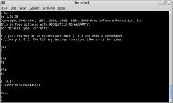

## El comando "bc"

Para llamar a la aplicación escribimos desde la consola la siguiente instrucción:

```bash
$ bc -il 
```

Con esta sentencia convocamos nuestra calculadora en modo interactivo (-i) y enlazando la librería matemática (-l)

Para obtener la lista completa de parámetros de esta aplicación, la ejecutamos:

```bash
$ bc --help
usage: bc [options] [file ...]
  -h  --help         print this usage and exit
  -i  --interactive  force interactive mode
  -l  --mathlib      use the predefined math routines
  -q  --quiet        do not print initial banner
  -s  --standard     non-standard bc constructs are errors
  -w  --warn         warn about non-standard bc constructs
  -v  --version      print version information and exit
```

<aside>

</aside>


## Cálculo de combinatorias y probabilidades

Para incorporar las funciones de cálculo de combinatorias debemos definir las correspondientes funciones en el ambiente de `bc`, también podemos pre-cargarlas a través de un archivo donde ya estén estas codificadas. Yo he preparado una versión de este archivo, que he llamado `bc_defines.bc`.

Aquí el contenido de este archivo:

```bash
pi = 4*a(1)
nep = e(1)
define fact (x) {
  if (x <= 1) return (1);
  return (fact(x-1) * x);
  }
define comb (n,x) {
  return fact(n)/(fact(n-x)*fact(x))
  }
define poisson (s,x) {
  return e(-s)*s^x/fact(x)
  }
define apoisson (s,x) { suma=0; for (i=0;i<=x;i++){ suma=suma+poisson(s,i)}; return suma}

define binomial (n,p,x) {
  return comb(n,x)*p^x*(1-p)^(n-x)
  }
define abinomial (n,p,x) { suma=0; for (i=0;i<=x;i++){ suma=suma+binomial(n,p,i)}; return suma}

define geometrica (p,x) {
  return p*(1-p)^x
  }
define ageometrica (p,x) { suma=0; for (i=0;i<=x;i++){ suma=suma+geometrica(p,i)}; return suma}

define binomialneg (n,p,x) {
  return comb(n+x-1,x)*p^n*(1-p)^x
  }
define abinomialneg (n,p,x) { suma=0; for (i=0;i<=x;i++){ suma=suma+binomialneg(n,p,i)}; return suma}

define hipergeometrica (n,m,k,x) {
  return comb(m,x)*comb(k,n-x)/comb(m+k,n)
  }
define ahipergeometrica (n,m,p,x) { suma=0; for (i=0;i<=x;i++){ suma=suma+hipergeometrica(n,m,p,i)}; return suma}
```

Para ejecutar *bc* con las funciones que predefinimos escribimos:

```bash
$ bc -il bc_defines.bc
```

En el, se implementan una serie de funciones que describo a continuación:

- `comb (n,x)`: Combinaciones de n en x.
- `poisson (s,x)`: Función de probabilidad de la Poisson en x con parámetro s.
- `apoisson (s,x)`: Función de probabilidad acumulada de la Poisson en x con parámetro s.
- `binomial (n,p,x)`: Función de probabilidad de la Binomial en x con parámetros n y p.
- `abinomial (n,p,x)`: Función de probabilidad acumulada de la Binomial en x con parámetros n y p.
- `geometrica (p,x)`: Función de probabilidad de la Geométrica en x con parámetro p.
- `ageometrica (p,x)`: Función de probabilidad acumulada de la Geométrica en x con parámetro p.
- `binomialneg (n,p,x)`: Función de probabilidad de la Binomial Negativa en x con parámetros n y p.
- `abinomialneg (n,p,x)`: Función de probabilidad acumulada de la Binomial Negativa en x con parámetros n y p.
- `hipergeometrica (n,m,k,x)`: Función de probabilidad de la Hipergeométrica en x con parámetros n, m y k.
- `ahipergeometrica (n,m,p,x)`: Función de probabilidad acumulada de la Hipergeométrica en x con parámetros n, m y k.

## Referencias

- [Cálculo numérico con bc](http://marcmmw.freeshell.org/esp/programacion/bc.html)

Espero que les sirva...

