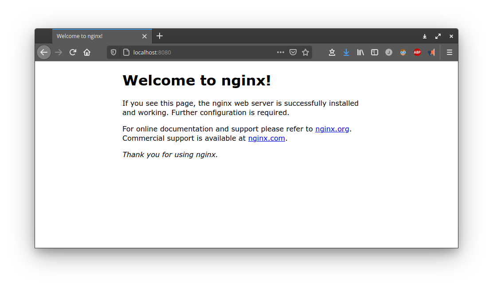
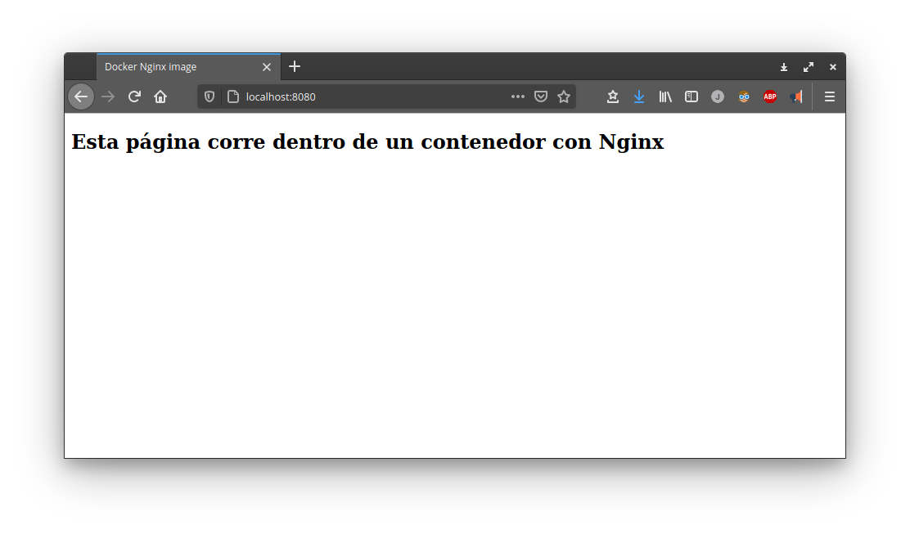

NGINX es un servidor web muy ligero y eficiente, que es usado por desarrolladores y en ingenieros de operaciones, no solo para proveer todo tipo de aplicaciones web, sino también como proxi inverso. 

Para reproducir este tutorial necesitaras:

- Tener instalado [Docker](https://docs.docker.com/get-docker/) en tu sistema
- Tener una cuenta o registrarte en [DockerHub](https://hub.docker.com) para acceder a las imágenes oficiales de NGINX y muchas otras

## Enlaces importantes

- [Docker Official Images](https://docs.docker.com/docker-hub/official_images/) 
- [NGINX official image](https://hub.docker.com/_/nginx) 


## Corriendo un Web service básico

Podemos ejecutar *docker* por línea de comandos o por el *Docker Desktop*

```bash
docker run --rm -d -p 8080:80 --name webapp nginx
```

Vemos brevemente el significado de los parámetros utilizados:

- `--rm`: Le indica al motor de docker, que una vez que se apague el servicio, elimine el contenedor.
- `-d`: Indica que ser servicio debe ejecutarse como un demonio o servicio que escuha un determinado puerto (80).
- `-p`: Permite mapear el puerto 80 del *NGINX* al puerto 8080 de nuestro equipo local (localhost).
- `--name`: Opcional, podemos indicar un nombre para el contenedor.
- `nginx`: Nombre de la imagen a ejecutar (nginx oficial), si no esta descarada, procederá a hacerlo


## Ejecutando la web por defecto

Bastara con acceder a la dirección http://locahost:8080/ para acceder a la página, por defecto, de NGINX:



## Desplegando nuestra propia WebApp

Cómo demostración, crearemos un HTML simple como página principal (*index.html*):

```HTML
<!doctype html>
<html lang="en">
<head>
  <meta charset="utf-8">
  <title>Docker Nginx image</title>
</head>
<body>
  <h2>Esta página corre dentro de un contenedor con Nginx</h2>
</body>
</html>
```

Desplegamos el contenedor con nuestro HTML personalizado:

```bash
docker run --rm -d -p 8080:80 --name webapp -v /path_to_html_dir:/usr/share/nginx/html nginx
```

El parámetro *-v* de docker permite compartir un archivo o directorio local con el contenedor a través de u protocolo llamado **HostPath**. De esta manero podemos realizar cambios en la aplicación desde nuestro ambiente de desarrollo local y ver sus efectos en el servicio dockerizado que lo expone.

Accediendo a nuestra WebApp local, ahora vemos nuestra versión del *index.html*:



**Fuente**: https://www.docker.com/blog/how-to-use-the-official-nginx-docker-image/

