# Primeros pasos con la Raspberry Pi, modelo B

Domingo, 01 de Septiembre de 2013

El Raspberry Pi es uno de los proyectos más importantes, surgidos en los últimos años,  que están orientados a promover el aprendizaje de la informática en los  niños a muy bajo costo. Consiste en una placa base, que con el precio de 35$, contiene todos los elementos de un completo computador pero con  las dimensiones de una tarjeta de crédito. 

La [Raspberry Pi](http://www.raspberrypi.org/) tiene una capacidad de  procesamiento equivalente a la de una netbook sencilla y un consumo de  energía mínimo. Esto no representa un grave problema de capacidad, dado  que es que capaz de presentar video en HD y manejar aplicaciones 3D con [OpenGL 2.0](http://www.opengl.org/), esto la convierte en una potencial herramienta para agregar capacidad, inteligencia y autonomía a nuestros robots.


## Un poco de historia.

[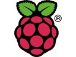](../../images/raspberry_pi/Raspberry_Pi_logo.jpg) Este proyecto es bastante reciente. A pesar de que los primeros diseños de [Raspberry Pi](http://www.raspberrypi.org/) fueron en el 2006, fue en el 2011 que se creo una fundación para su  producción y su administrador, Eben Upton, se puso en contacto con un  grupo de profesores, académicos y entusiastas de la informática para  crear un ordenador con la intención de animar a los niños a aprender  informática. En agosto de 2011, se fabricaron cincuenta placas alpha.  Las primeras ventas comenzaron el 29 de febrero de 2012. (fuente [Wikipedia](http://es.wikipedia.org/wiki/Raspberry_Pi)). La tarjeta con la que estaré haciendo mis experimentos es una modelo B, fabricada en diciembre del 2011. 


## Características de la Raspberry Pi (Modelo B)

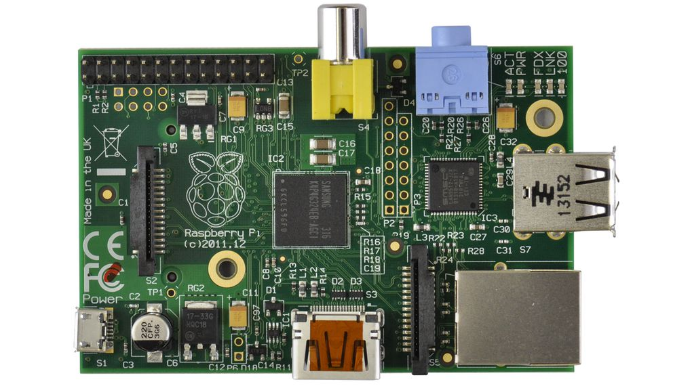Después de un par de meses de espera, llego mi esperada Raspberry Pi. La  primera impresión es que se trata de una dispositivos muy simple y  pequeño. Pero después de analizar sus componentes y características  llego a la conclusión de que se trata de un completo computador, sobre  el cual puedo probar mis distribuciones favoritas de GNU/Linux. Estas  son sus especificaciones:

- Precio:  $35 (aprox)

- SoC:  Broadcom BCM2835 (CPU + GPU + DSP + SDRAM + puerto USB)

- CPU:   ARM1176JZF-S a 700 MHz (familia ARM11)

- GPU:   Broadcom VideoCore IV,59 , OpenGL ES 2.0, MPEG-2 y VC-1 (con licencia),57 1080p30 H.264/MPEG-4 AVC

- Memoria (SDRAM):   512 MB (compartidos con la GPU)4 desde el 15 de octubre de 2012

- Puertos USB 2.0:   2 (vía hub USB integrado)

- Entradas de vídeo:   Conector [[MIPI] CSI que permite instalar un módulo de cámara desarrollado por la RPF

- Salidas de vídeo:  Conector RCA (PAL y NTSC), HDMI (rev1.3 y 1.4), Interfaz DSI para panel LCD 

- Salidas de audio:  Conector de 3.5 mm, HDMI

- Almacenamiento integrado:  SD / MMC / ranura para SDIO

- Conectividad de red:  10/100 Ethernet (RJ-45) via hub USB

- Periféricos de bajo nivel:   8 x GPIO, SPI, I²C, UART

- Reloj en tiempo real:  Ninguno

- Consumo energético:  700 mA, (3.5 W)

- Fuente de alimentación:  5 V vía Micro USB o GPIO header

- Dimensiones:  85.60mm × 53.98mm64 (3.370 × 2.125 inch)

- Sistemas operativos soportados:   

- GNU/Linux: 

- - Debian (Raspbian)
  - Fedora (Pidora)
  - Arch Linux (Arch Linux ARM)
  - Slackware
  - RISC OS2

[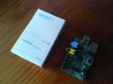](../../images/raspberry_pi/Raspberry_Pi_IMG_20130624_112558.jpg) [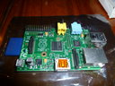](../../images/raspberry_pi/Raspberry_Pi_P1020048.JPG) [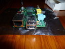](../../images/raspberry_pi/Raspberry_Pi_P1020050.JPG)  


## Experimentos con la Raspberry Pi.

Como todo proyecto para fomentar el desarrollo, la Raspberry Pi tiene un  gran número de posibles usos, el límite es la imaginación. Aquí expongo  algunos usos comunes con los que he comenzado a experimentar:


- Sistema de propósito general: el primer uso que le podemos dar a nuestra  Raspberry Pi, es la de una computador común. Podemos usar todos los  periféricos comunes. Como monitor podemos emplear un televisor  convencional, dado que tenemos salidas RCA de video analógico y HDMI de  video digital. Hice la prueba de una convertidor de HDMI a DVI y la  conecté a un monitor sin ningún problema. 

<aside>
[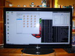](../../images/raspberry_pi/Raspberry_Pi_P1020060.JPG)
</aside>

- Media Center con [XBMC](http://xbmc.org/): Otro posible uso que me parece más interesante, es el de emplear la [RaspBerry Pi para construir un Media Center](http://wiki.xbmc.org/index.php?title=HOW-TO:Install_XBMC_on_Raspberry_Pi). Podemos integrar en una misma interfaz, el despligue de videos y  multimedia de varias fuentes como la televisión y el Internet. Existe  un proyecto en Software Libre, que tiene esto como objetivo, llamado  XBMC y puede ser extendido mediante la programación de pluggins en  Python. He dedicado otro post para mostrar como hacer esto. Fuente en [Wikipedia](http://es.wikipedia.org/wiki/XBMC). 

<aside>
[](../../images/raspberry_pi/Raspberry_Pi_P1020063.JPG)
</aside>

- Control de Robots y Domótica: Su pequeño tamaño y su gran capacidad posibilita  su utilización en robótica ya que podemos incorporar un completo  computador en nuestros pequeños robot, dotándolos de la capacidad de  procesamiento y comunicaciones que ofrecen los sistemas operativos  modernos. También la automatización de algunas acciones como el  encendido y apagado de luces, registro de sensores de movimiento,  temperatura, etc. Mi primer experimento, que comentaré en otro [post](http://192.168.0.105/personalweb/index.php/robotica/116-raspberry-pi/109-vehiculo-robot-con-lego-minsdstorm-y-una-raspberry-pi), fué adaptar la Raspberry Pi a un vehículo Lego Technic (8081) y  motorizado con Mindstorm y manejado por una aplicación hecha en Python.  

<aside>
[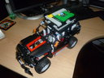](../../images/raspberry_pi/Raspberry_Pi_P1030183.JPG)
</aside>


## Los primeros pasos

Los primeros pasos están bien descritos en el documento [QuckStart](http://www.raspberrypi.org/wp-content/uploads/2012/04/quick-start-guide-v2_1.pdf) que podemos encontrar en el sito de la [Raspberry Pi](http://www.raspberrypi.org/), este documento describe como instalar la imagen de [Raspbian](http://www.raspbian.org/), un sistema operativo basado en Debian wheezy sobre una memoria SD. En  principio no nos hará falta realizar el proceso de instalación del  sistema operativo, ya que podemos encontrar un buen número de imágenes  de sistemas adaptados a nuestro nuevo juguete. En el propio [sitio de descargas de Raspberry Pi](http://www.raspberrypi.org/downloads) podemos encontrar varias de ellas.

<aside>
[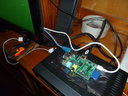](../../images/raspberry_pi/Raspberry_Pi_P1020065.JPG)
</aside>

### Componentes básicos.  

1. La Raspberry Pi, por supuesto.
2. Una memoria SD de 4Gb o más. Aunque algunas imágenes requieren 1G o hasta 2G como mínimo y preferiblemente de Clase 10. 
3. Un transformador DC de 5v con salida mini-USB.
4. Un cable HDMI o RCA para el televisor.
5. Un teclado USB o inalambrico (con receptor USB).
6. Un mouse USB o inalambrico (con receptor USB).
7. Opcionalmente un cable RJ45 conectado al Switch o Hub para acceso a la red de datos o a Internet.


### Instalación del sistema operativo.

A continuación describiré con un poco más de detalle los pasos, en Linux, para solventar algunos obstáculos a los que nos podríamos enfrentar  instalando un sistema operativo sobre una memoria SD, ya que loas  instrucciones que se encuentra por ahí son para Windows:

Vamos al sitio de descargas y bajamos la imagen comprimida del sistema operativo Raspbian, a la fecha, la ultima es la del 26/07/2013:

```bash
wget http://downloads.raspberrypi.org/images/raspbian/2013-07-26-wheezy-raspbian/2013-07-26-wheezy-raspbian.zip
unzip 2013-07-26-wheezy-raspbian.zip
```

Luego copiaremos la images escogida sobre la memoria SD que nos servirá de disco para la Raspberry Pi, [aquí](http://elinux.org/RPi_Easy_SD_Card_Setup) un breve tutorial. Es importante respaldar lo que tengamos ahí dado que el contenido previo se perderá, para esto usaremos el comando **dd**, con los parámetros **if** (dirección d ela imagen a utilizar), **of** (dispositivo de destino) y **bs** (tamaño de los bloques de memoria a manejar en la copia) . Si suponemos que la unidad SD fue detectada como **/dev/disk1**, la instrucción quedaría así:

<aside>
[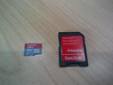](../../images/raspberry_pi/Raspberry_Pi_IMG_20130901_160446.jpg)
</aside>

```bash
dd if=2013-07-26-wheezy-raspbian.img of=/dev/disk1 
```

Después de unos minutos, esta instrucción copia la imagen sobre el dispositivo  de almacenamiento (Memoria SD). Es este punto es importante tener varias cosas en cuenta. Se puede mejorar la velocidad de copiado raster (dd)  aumentado el tamaño de los bloques (aprovechando la capacidad DMA de  nuestro equipo), en algunos caso puede funcionar bs=4m o más. Otro punto importante es que, obviamente, la memoria física debe ser igual o mayor que la imagen (.iso ó .img). Lo común es que no sea igual sino mayor,  con lo que deberíamos extender el formato de la partición para que  nuestro sistema aproveche toda la capacidad de la memoria SD, esto lo  haremos más adelante con **expand_rootfs**. Si no contamos una memora de gran capacidad, podemos escoger alguna distro que sea minimalista.  Por ejemplo contamos con una imagen de Arch linux que cabe perfectamente en una memoria SD de 1Gb de capacidad, aquí un tutorial para adaptar  ese sistema a nuestra Raspberry Pi. Otro punto muy importante es que  debemos escribir la imagen del sistema (.iso ó .img) sobre todo el  dispositivo de almacenamiento, no sobre una partición particular. Si la  memoria ya esta formateada, es podible que nuestro sistema reconozca una o varias de las particiones como por ejemplo **/dev/Disk1s1** o /**dev/Disk2s1**, es estos caso las letras sx corresponde a particiones, es por eso que deberemos utilizar **/dev/disk1** o **/dev/disk2** respectivamente. He leído en varios foros que puede que algunas  memorias SD no son reconocidas o compatibles con la Raspberry, esto no  me ha ocurrido con mi modelo B, a pesar de haber probado unas 4 o 5  memorias de diferentes marcas, clases y tamaños.


### Inicio por primera vez con el Raspbian.  

Una vez que contamos son el sistema operativo, en este caso Rasbian, sobre  la memoria SD, debemos introducirla en la ranura que se encuentra en la  parte de abajo de la Raspberry. Ahora solo queda conectar la salida de  video, el teclado (y mouse) y encenderla. Como habrán notado, la  Raspeberry no cuenta con un interruptor, por o que encenderá en cuanto  conectemos la alimentación de corriente. En este punto, es posible que  la Raspberry no encienda, recuerden que la Raspberry no cuenta con  baterías y la alimentación debe ser de 5v DC. Algunos cargadores de  celulares no proveen una corriente continua estable por lo que no nos  funcionaran, yo tuve que hacer varios intentos hasta que conseguí uno  bueno. Los siguientes pasos están descritos a continuación:

<aside>
[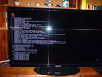](../../images/raspberry_pi/Raspberry_Pi_P1020058.JPG)
</aside>

En el primer arranque se activara el **Raspi-conf** que nos permitirá hacer las configuraciones del equipo. Esta es una de  las ventajas de las Rasbian, que cuenta con un sistema de ventanas que  nos facilitará la configuración inicial. Esto solo se requiere hacer una vez y nos permitirá hacer cosas como:

<aside>
[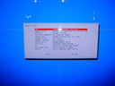](../../images/raspberry_pi/Raspberry_Pi_P1020055.JPG)
</aside>

1. 1. Extender el formato sobre todo el espacio de la memoria SD (**expand_rootfs**).
   2. Cambiar el password del usuario"**pi**" está creado por defecto. 
   3. Cambiar la zona horaria y la fecha y hora del sistema.
   4. Configurar el teclado y el idioma (**locale**).
   5. Configurar el overclock (pasar la frecuancia del procesador de 700MHz a 1000Mhz).
   6. Activar el servicio **SSH** en el arranque.
   7. Activar el ambiente gráfico en el arranque.
   8. Al final aceptaremos la opcion de reinicio. 

La Raspberry Pi iniciará solicitándonos el Login y el Password a lo que responderemos con "**pi**" y "**raspberry**" respectivamente (sin comillas). Luego aparecerá el prompt: **pi@raspberry ~ $** y ya estamos listos para usarla...


### Reproducción de video

Ahora podemos comenzar a utilizar nuestro sistema, por ejemplo si tenemos una película en un pendrive, podemos verla en el televisor con el comando **omxplayer**, por ejemplo, sustituyendo el path por el adecuado a su caso:

```bash
omxplayer /media/sda1/video.mp4
```

El **omxplayer** asume por defecto que la salida utilizada es la análogica, en caso de  estar usando la salida HDMI deberemos incorporar el parámetro **-hdmi** así: 

```bash
omxplayer -hdmi /media/sda1/video.mp4
```


### Ambiente gráfico.

Desde luego que más interesante para observar las capacidades de la Raspberry es trabajar con ventanas, por ejemplo para iniciar el ambiente gráfico  (si es que tenemos conectado un televisor o monitor) podemos introducir  la instrucción que lo iniciará: **startx**

<aside>
[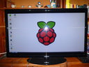](../../images/raspberry_pi/Raspberry_Pi_P1020059.JPG)
</aside>

### Instalacion de nuevos software.  

Hasta ahora podemos usar nuestra Raspebrry Pi como un computador tradicional. Pero dependiendo del espacio disponible que tengamos en nuestra memoria SD, podemos instalar nuevas aplicaciones, por cualquiera de los métodos tradicionales. Yo recogimiento[ configurar a mano el repositorio](http://www.raspbian.org/RaspbianRepository) que usaremos ya que la selección automática de repositorios ([master](http://archive.raspbian.org/)) me manda a Brasil, que no es la mejor opción en mi caso.
Aquí podemos encontrar una lista de [repositorios oficiales de Raspbian](http://www.raspbian.org/RaspbianMirrors) según zonas geográficas, yo escogí EEUU. Luego toca el repositorio  escogido en el archivo, quedando algo así. Luego solo queda actualizar  el índice de paquetes disponibles con **apt-get uptate**, y si queremos actualizar nuestro sistema usaremos **apt-get upgrade**.

<aside>
[](../../images/raspberry_pi/Raspberry_Pi_P1020060.JPG)
</aside>

```bash
sudo apt-get update
sudo apt-get upgrade
```


Ahora podemos instalar aplicaciones con el comando **apt-get install**  o instalar un manejador gráfico de paquetes de software, como **synaptic**:

```bash
sudo apt-get install synaptic
```

Luego será mucho más fácil la instalación de nuevos programas, yo recomiendo para comenzar :

- **Firefox**: un mejor y más actualizado navegador.
- **VCL**: un muy buen reproductor de video.
- **ffmpeg**: sistema de programas de consola útiles para la manipulación de video y audio.
- **ImageMagick**: sistema de programas de consola para la manipulación de imágenes.
- **XBMC**: El mejor software de Media Center para Linux.


### Escritorio remoto. 

Podemos controlar nuestra Raspberry desde nuestro equipo de escritorio de  manera gráfica, a través del escritorio remoto que provee el protocolo [**VNC**](http://www.google.co.ve/url?sa=t&rct=j&q=vnc&source=web&cd=2&cad=rja&sqi=2&ved=0CEIQFjAB&url=http%3A%2F%2Fes.wikipedia.org%2Fwiki%2FVNC&ei=ayArUpmWH4P28gSpp4DIBA&usg=AFQjCNGYGcJHZ3fZiWuv2xhjJb8TvGyATw&bvm=bv.51773540,d.eWU). Para ello debemos descargar el servidor en nuestra Raspberry e iniciar el servicio así:

<aside>
[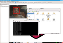](../../images/raspberry_pi/Raspberry_Pi_face_detector01.png)
</aside>

```bash
sudo apt-get install tightvncserver
vncserver :1 -geometry 1024x768 -depth 16 -pixelformat rgb565
```

Una buena opción es incluir esta instrucción en un archivo script, que  luego podemos ejecutar automaticamente al arrancar, de manera de no  requerir la salida con el televisor. 

Luego podemos ver y manejar el escritorio remotamente desde una variedad de dispositivos y aplicaciones clientes de **VNC**, por ejemplo en KDE tenemos el [**Krdc**](http://www.kde.org/applications/internet/krdc/), en Gnome tenemos el [**Vinagre**](https://projects.gnome.org/vinagre/), en Windows el [**RealVNC**](http://www.realvnc.com/), Putty y en Android el [**AndroidVNC**](https://play.google.com/store/apps/details?id=android.androidVNC&hl=es_419). Un punto importante para el acceso remoto a nuestra Raspberry es que  debemos conocer el IP que ha tomado en nuestra red. Esto lo podemos  saber con el comando **ifconfig** pero podría ser un problema si no  tenemos conectada a ella periféricos de entrada y salida (teclado y  monitor). Para resolver eso recurrí a la pantalla de administración de  mi switch casero en donde encontré la Raspberry en el área de clientes  de red (DHCP). 

Otra manera de ejecutar aplicaciones remotamente, con interfaces gráficas, es a través del protocolo SSH, como lo he  descrito en [otro post](http://192.168.0.105/index.php/recetas-gnu-linux/82-como-ejecucar-comandos-remotos-con-ssh), podemos escribir desde nuestro PC el comando remoto de la siguiente manera, sustituyendo por la dirección de tu Raspberry Pi:

```bash
ssh -X -l pi 192.168.1.13
```


## Componentes adicionales.

Dependiendo del proyecto en el que queramos trabajar, será necesario incorporar nuevos componentes como por ejemplo: 

- **Hub USB 4 puertos** (sin alimentación adicional) nos permitirá incorpora una mayor número  de perifericos. Recordemos que unestra raspeberry cuenta solo con 2  puertos USB, de esta forma podemos extender hasta 5 la capacidad de  puertos. 
- **Dungle Wifi USB**, si deseamos incorporar la Raspberry en nuestros robots, sera neceario poder matener la conexión a lared de forma inalambrica. 
- **Convertidor HDMI-DVI** será necesario si deseamos utilizar un monitor convencional con entrada digital. 
- **Módulo de Cámara integrada**. Hace poco se publicó la producción de un nuevo módulo de camara para el Raspberry Pi. 
- **Dongle Bluetooth USB**, útil si deseamos controlar nuestro Raspberry desde dispositivos  celulares y necesario si queremos acceder a perifericos como la Wiimote.

 [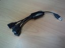](../../images/raspberry_pi/Raspberry_Pi_IMG_20130901_160630.jpg) [](../../images/raspberry_pi/Raspberry_Pi_IMG_20130901_161039.jpg) [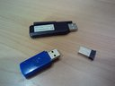](../../images/raspberry_pi/Raspberry_Pi_IMG_20130901_161101.jpg) 


## Seleccionando un sistema operativo

La selección del sistema  oerativo, o mejor dicho, distribución de Linux que usaremo para nuestro  Raspberry Pi dependerá, como siempre del gusto de cada quien. Existen  versiones de las principales ditribuciones más algnas de proposito  especifico. Hasta ahora solo he porbado unas cuantas distros que listare a continuacion:

**Distro de proposito general:** 

- [Raspbian](http://www.raspbian.org/): Sistema operativo basado en Debian wheezy. esta [imágen](http://downloads.raspberrypi.org/images/raspbian/2013-07-26-wheezy-raspbian/2013-07-26-wheezy-raspbian.zip) viene bastante competa y ocupa unos 1.8Gb, por lo que debe ser instalada en una memoria de al menos, 2Gb.
- Arch Linux: Es un sistema que requiere un poco mas de trabajo par su  configuración, sin embargo tiene bastantes adeptos. A pesar de que la [imagen](http://downloads.raspberrypi.org/images/archlinuxarm/archlinux-hf-2013-07-22/archlinux-hf-2013-07-22.img.zip) ocupa 1.8Gb, el sistema ya instalado es mucho más pequeño.


## Mis próximos proyectos con la Raspberry Pi

**Carro robot controlado con una Raspberry Pi**: como ya lo he mencionado la incorporación de un computador de este  tipo, permite aprovechar la movilidad y autonomía que permite su pequeño tamaño, peso y consumo eléctrico. Este proyecto busca construir un  pequeño vehículo robot con la suficiente autonomía y capacidad de  procesamiento que me permita experimentar con temas de Inteligencia  Artificial en el control de movimiento y ejecución de tareas.

**Control de equilibrio**: Un segway con lego+wiimote+raspberry: Este pequeño computador viene a  complementar la tarea de construir un robot de dos ruedas, capaz de  mantener el equilibrio y responsear instrucciones por voz.

**Smart-TV Pi**: La idea es construir un pequeño “Set Up Box” o decodificador para la  televisión digital abierta (TDA) pero con capacidad de integrar en un  mismo dispositivo, al estilo de un completo Media Center con XBMC, la  posibilidad de no solo ver Televisión, en nuestro televisor, sino  también reproducir películas desde un pendrive y ver videos desde  canales de internet como Youtube, Vimeo, Cuevana, etc, convirtiendo así, nuestro televisor convencional en un Smart-Tv.

**Control por reconocimiento de Rostros y formas**: Por la entrada USB de nuestra Raspberry Pi, podemos conectar una webCam y con la programación de un sistema de reconocimiento de patrones  basado en OpenCV podemos aplicarlo en el control de vehículos robóticos. 

**Re-calibración automática de antenas de telecomunicaciones**: Este proyecto consiste en la posibilidad de construir un dispositivo  para integrarlo a las antenas de comunicaciones, para su re-calibración  automática. uno de los problemas de las comunicaciones satelitales, es  que los satélites sueles moverse y salir del espacio de visibilidad de  alguna antenas. Esto requiere de un ajuste de la posición de las mismas. La propuesta es usar la Raspberry para que, a través de la programación de redes neuronales, y el conocimiento previo de la posición del  satélite, se puedan calcular las trayectorias más probables que permitan re-calibrar la posición de las antenas con el uso de servomotores.


## Como programar con la Raspberry Pi

Las herramientas de programación de la [Raspberry Pi](http://www.raspberrypi.org/) son las mismas que contamos en nuestro sistema GNU/Linux, por lo que la elección depende, realmente, del gusto de cada quien, en mi caso:  Python y C/C++. Ahora bien, para el desarrollo de aplicaciones para el  control de robots hechos con el Lego MindStorm será necesario instalar [NXT-Python](http://code.google.com/p/nxt-python/) y [LibNXT](http://nxt.natulte.net/trac/wiki/LibNxt). Otra recomendación, si queremos hacer tareas de reconocimiento basado en el procesamiento de video, es instalar [OpenCV](http://192.168.0.105/personalweb/index.php/recetas-gnu-linux/112-compilacion-y-primeros-pasos-en-la-vision-por-computadora-con-opencv) y [FFmpeg](http://192.168.0.105/personalweb/index.php/recetas-gnu-linux/116-gestionando-videos-con-ffmpeg). Por ultimo y por ahora, recomiendo la librería [LibWiimote](http://libwiimote.sourceforge.net/) de conexión con la Wiimote que nos permitirá acceder a sus sensores  como cámara infrarroja y acelerometro, igualmente útiles en la robótica,


## Artículos y proyectos interesantes que he encontrado por ahí:

- [Adafruit Holiday Gift Guide 2012 – Raspberry Pi Kits & Accessories](http://www.adafruit.com/blog/2012/11/23/adafruit-holiday-gift-guide-2012-raspberry-pi-kits-accessories/)
- [Con ustedes, el Macintosh más pequeño del mundo](http://www.applesfera.com/curiosidades/con-ustedes-el-macintosh-mas-pequeno-del-mundo)
- [Raspberry PI: Programando el puerto GPIO con Qt Creator ](http://www.youtube.com/watch?v=WdA-mIvBBTw)
- [A,B,C...π ](http://marquitux.blogspot.com.ar/2013/06/abc.html)
- [Tutorial Raspberry Pi (Primeros pasos)](http://www.aquihayapuntes.com/índice-sistemas-embebidos/raspberry-pi-primeros-pasos.html)
- [Primeros pasos Raspberry Pi](http://www.electroensaimada.com/raspberry-pi.html)
- [How to set up Raspberry Pi ](http://www.linuxuser.co.uk/tutorials/how-to-set-up-raspberry-pi)
- [Installing Raspberry Pi on SD card on mac or linux ](http://www.heystephenwood.com/2013/05/installing-raspberry-pi-on-sd-card-on.html)
- [Los diez mejores proyectos](http://www.xatakahome.com/trucos-y-bricolaje-smart/para-que-podemos-usar-un-raspberry-pi-en-casa-los-diez-mejores-proyectos)
- [Diez proyectos que me gustaría hacer con la Raspberry Pi](http://www.xataka.com/informatica/diez-proyectos-que-me-gustaria-hacer-con-la-raspberry-pi)
- [Raspberry Pi ya tiene tienda de aplicaciones: Pi Store](http://www.xataka.com/otros/raspberry-pi-ya-tiene-tienda-de-aplicaciones-pi-store)
- [Accesorios para Raspberry Pi ](http://es.rs-online.com/web/generalDisplay.html?id=raspberrypi)
- [Raspberry Pi USB Power Issues - Ultimate Solution ](http://himeshp.blogspot.com/2012/07/raspberry-pi-usb-power-issues-ultimate.html)
- [University builds cheap supercomputer with Raspberry Pi and Legos](http://arstechnica.com/information-technology/2012/09/university-builds-cheap-supercomputer-with-raspberry-pi-and-legos/)
- [XBMC y tu Raspberry Pi: OpenELEC](http://www.xatakahome.com/centro-multimedia/xbmc-y-tu-raspberry-pi-openelec)