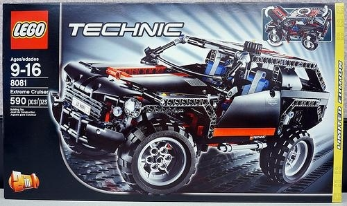
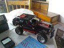
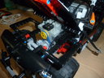
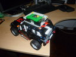
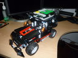
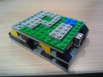
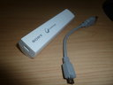

Este  proyecto consiste en adaptar la [Raspberry Pi](http://www.raspberrypi.org/) a  un vehículo [Lego Technic (8081)](http://shop.lego.com/en-US/Extreme-Cruiser-8081) y motorizado con [Mindstorm](http://mindstorms.lego.com/en-us/default.aspx), para luego programarlo y manejardo  por una aplicación hecha en Python.

<aside>
[](../../images/robotics/Raspberry_Pi_P1030183.JPG)
</aside>


## Controlando un carro robot con la Raspberry Pi

En otros posts he mostrado como construir robots y como programarlos o[ controlarlos desde dispositivos móviles](http://192.168.0.103/index.php/robotica/52-lego-mindstorm/103-controlando-nuestros-robots-desde-android). Sin embargo una de mis expectativas es poder conectarme vía **SSH** a los robots y controlar todas sus funciones internas remotamente. Esto implicaría que nuestro robot incluyera un computador corriendo un  sistema operativo más completo que el que proporciona el [**NXT**](http://en.wikipedia.org/wiki/Lego_Mindstorms_NXT_2.0). Esto ahora lo puedo hacer, gracias a la [**Raspberry Pi**](http://www.raspberrypi.org/). Este proyecto busca adaptar la Raspberry Pi a un [vehículo Lego Technic (8081)](http://shop.lego.com/en-US/Extreme-Cruiser-8081) y motorizado con [Mindstorm](http://mindstorms.lego.com/en-us/default.aspx) y manejado por una aplicación hecha en Python, la cual podemos ejecutar y manejar vía **SSH**. Esta solución es mucho mas efectiva que la de usar una remolque para una netbook como en el experimento de "[controlar un carro robot desde una Canaimita](http://192.168.0.103/index.php/robotica/52-lego-mindstorm/78-carro-robot-controlado-desde-una-qcanaimitaq)" de hace una par de años. 


## El modelo Lego technic 8081 Extreme Cruise

Aunque pudiéramos usar nuestro [carro robot de propósito general](http://192.168.0.103/index.php/robotica/52-lego-mindstorm/77-carro-robot-de-proposito-general) para este proyecto, he disidido utilizar otro modelo de vehículo, el [Extreme Cruise (8081) ](http://shop.lego.com/en-US/Extreme-Cruiser-8081)de [Lego Technic](http://www.lego.com/en-us/technic/?domainredir=technic.lego.com) que me llego hace poco (lo conseguí bastante barato en Madrid y un  amigo me lo trajo). Este modelo de vehículo tiene varias ventajas como  la amortiguación y el tamaño de las ruedas que lo convierten en una  especie de “todo terreno”. Aunque no trae motores, si posee los  mecanismos de dirección delantera y de tracción con diferencial. Con el  mismo set se pueden armar dos modelos, aquí dejo las instrucciones ([1](http://192.168.0.103/archivos/download5480B6B9E136BBEF6DDAD0373AE06A53_1.pdf), [2](http://192.168.0.103/archivos/downloadACFE318CFA91BC90A3840BF2ACCD0B8E_2.pdf) y [3](http://192.168.0.103/archivos/downloadA50498A071E9F5CC9B0DF037F590459D_3.pdf)) para su ensamblado.

[](../../images/robotics/Lego_8081_tn_IMG_20130130_144831.jpg)


Queda +/- así, aunque no pretendo dejarlo así por mucho rato, la idea es incorporarle la capacidad de movimiento con motores.


 [](../../images/robotics/Raspberry_Pi_Lego_8081_IMG_20130130_144840.jpg) [](../../images/robotics/Raspberry_Pi_Lego_8081_IMG_20130130_144852.jpg) [](../../images/robotics/Raspberry_Pi_Lego_8081_IMG_20130130_144904.jpg) 


## Agregando motores al Extreme Crouser con el MindStorm

He aquí donde se integran nuestro modelo **8081** con el **Mindstorm**. Esta tarea consistió esencialmente en incorporar dos motores, uno para  la dirección y otro para la tracción. Este trabajo requirió hacer  espacio, quitando el modelo de motor original y los asientos. Por ultimo amplié un poco la parte trasera levantando el techo para que entrara el bloque [NXT](http://en.wikipedia.org/wiki/Lego_Mindstorms_NXT_2.0).

Aquí algunas imágenes de como quedó:

 [](../../images/robotics/Raspberry_Pi_P1030180.JPG) [](../../images/robotics/Raspberry_Pi_P1030181.JPG) [](../../images/robotics/Raspberry_Pi_P1030179.JPG)  

Hasta este punto ya es posible manejar nuestro vehículo a control remoto, utilizando el Bluetooth del [NXT](http://en.wikipedia.org/wiki/Lego_Mindstorms_NXT_2.0) desde [aplicaciones Android](http://192.168.0.103/index.php/robotica/52-lego-mindstorm/103-controlando-nuestros-robots-desde-android) en nuestra Smartphone o tableta tal como lo mencioné antes, sin embargo el objetivo de este proyecto es otro. 


## Adaptando la Raspberry Pi a nuestro vehículo robot.

Ahora integraremos la [Raspberry Pi](http://www.raspberrypi.org/) con nuestro vehículo. Para esto usaremos unos pocos componentes. Junto con la Raspberry Pi necesitaremos:

<aside>
[](../../images/robotics/Raspberry_Pi_raspberry-pi-modelo-b.jpg)
</aside>


- Un dungle Wifi USB conectado a la [**Raspberry Pi**](http://www.raspberrypi.org/) para el acceso remoto vía **SSH** al control del vehículo.
- Una [carcasa protectora](http://192.168.0.103/index.php/robotica/52-lego-mindstorm/110-carcasa-protectora-lego-para-mi-raspberry-pi) que facilite la integración del Raspberry con el vehículo Lego
- Una [Batería recargable](http://192.168.0.103/index.php/robotica/52-lego-mindstorm/111-alimentacion-a-baterias-de-la-raspberry-pi-) para la alimentación de corriente para el [**Raspberry Pi**](http://www.raspberrypi.org/), recordemos que le [NXT](http://en.wikipedia.org/wiki/Lego_Mindstorms_NXT_2.0) usa pilas AA.
- Un cable USB para conectar las [**Raspberry Pi**](http://www.raspberrypi.org/) con el [NXT](http://en.wikipedia.org/wiki/Lego_Mindstorms_NXT_2.0)

Aquí podemos ver algunas imágenes:

| [](../../images/robotics/Raspberry_Pi_P1030185.JPG) | [](../../images/robotics/Raspberry_Pi_P1030182.JPG) | [](../../images/robotics/Raspberry_Pi_P1030177.JPG) |
| ------------------------------------------------------------ | ------------------------------------------------------------ | ------------------------------------------------------------ |
| [](../../images/robotics/Raspberry_Pi_IMG_20130901_161039.jpg) | [](../../images/robotics/Raspberry_Pi_IMG_20130901_085817.jpg) | [ ](../../images/robotics/Raspberry_Pi_P1030187.JPG) |

  [ ](http://192.168.0.103/images/stories/robotica/Raspberry_Pi_IMG_20130901_085817.jpg) 


## Libreria para el control del NXT desde Python: nxt-python 

Para controlar el [NXT](http://en.wikipedia.org/wiki/Lego_Mindstorms_NXT_2.0) desde el Raspberry Pi debemos instalar en el, la librería [nxt-python](http://code.google.com/p/nxt-python/). Esta librería tiene un par de dependencias que deberemos instalar previamente, estas son [PyUSB](http://sourceforge.net/projects/pyusb/) y [PyBluez](http://code.google.com/p/pybluez/downloads/list), que nos permitirán conectarnos al [NXT](http://en.wikipedia.org/wiki/Lego_Mindstorms_NXT_2.0) ya sea por USB o por Bluetooth. para el momento de escribir esto, las últimas versiones eran [nxt-python-2.2.2.tar.gz](http://code.google.com/p/nxt-python/downloads/detail?name=nxt-python-2.2.2.tar.gz), **[pyusb-1.0.0a3.zip](http://sourceforge.net/projects/pyusb/files/latest/download?source=files)** y [PyBluez-0.18.tar.gz](http://code.google.com/p/pybluez/downloads/detail?name=PyBluez-0.18.tar.gz&can=2&q=) que una vez descargadas en un directorio temporal, creamos el grupo "lego" y como root, las podemos instalar así:

```bash
su -
cd path_al-dir_de_descarga/
groupadd lego
usermod -a -G lego
unzip pyusb-1.0.0a3.zip
cd pyusb-1.0.0a3
python setup.py install
cd ..
tar zxvf PyBluez-0.18.tar.gz
cd PyBluez-0.18
python setup.py install
cd ..
tar zxvf nxt-python-2.2.2.tar.gz
cd nxt-python-2.2.2
python setup.py install
```

Para que el sistema identifique correctamente el dispositivonecesitamos agregar esta regla en el **udev**:

```bash
SUBSYSTEM=="usb", ATTRS{idVendor}=="0694", GROUP="lego", MODE="0660"
```


## Programando nuestro vehículo robot con Python


Esta es la parte más interesante del proyecto. La mayoría de los lenguajes  de programación de propósito especifico para el control del [NXT](http://en.wikipedia.org/wiki/Lego_Mindstorms_NXT_2.0) lo modelan como una máquina de estados. Esta concepción facilita el  manejo de la concurrencia propia del funcionamiento en paralelo de los  efectores o del manejo de las interrupciones asociadas a los registro de los sensores. Sin embargo este no es el caso de los lenguajes de  propósito general como C/C++ o Python. 

La concurrencia en un lenguaje como Python puede ser modelada mediante el uso de hilos de  ejecución (threads). Adicionalmente usaremos la librería [nxt-python](http://code.google.com/p/nxt-python/) para el control del bloque [NXT](http://en.wikipedia.org/wiki/Lego_Mindstorms_NXT_2.0). Aquí podemos encontrar [algunos ejemplos](https://github.com/skorokithakis/nxt-python/tree/master/examples) de como emplear esta librería. También dejo aquí el enlace a un buen [tutorial de Python](http://mundogeek.net/tutorial-python/). 

Este no fue el enfoque asumido en el proyecto de [carro robot controlado por Python](http://192.168.0.103/index.php/robotica/52-lego-mindstorm/77-carro-robot-de-proposito-general), porque no manejaba sensores y la interface era mucho más simple y se basaba en instrucción-acción.

Nuestro ejemplo consta de 3 tipos de funciones. Tenemos el **programa principal**, que inicializa las variables de estado, instancia las conexiones con el [NXT](http://en.wikipedia.org/wiki/Lego_Mindstorms_NXT_2.0) y los hilos de ejecución que activan los efectores. Finalmente el  programa principal contiene el ciclo de recepción y despacho de las  instrucciones de entrada.

Las funciones **tracción** y **dirección**, son manejadas como hilos de ejecución paralela y se encargan de activar los efectores (motores) y controlar su velocidad. Debido a que es  posible que se le vaya colocando más peso a nuestros robots, es  preferible usar siempre la máxima potencia (100), de manera que el  control de la velocidad de puede realizar por la activación intermitente de los motores, incrementando o reduciendo los espacios de tiempo de  inactividad en función de reducir o aumentar la velocidad.

Por ultimo están las funciones que modifican las **variables de estado** de manera de variar el estado del sistema y de ejercer control sobre los efectores. Estas funciones son **avanzar**, **retroceder**, **izquierda** y **derecha**. Próximamente tendremos variables para la gestión de los sensores.

Aquí podemos ver el código de la aplicación en su primera versión (carro01.py)

```python
#!/usr/bin/env python

import nxt.locator
from nxt.motor import *
import time
import thread
import consola_io

def menu():
 print """

   Menu de opciones
   \----------------

   1.-  Derecha  k
   2.-  Izquierda  h 
   3.-  Avanzar  j
   4.-  Retroceder  m   
   SP.- Mostrar menu
   ESC.- Terminar s
 """


def derecha():
  Direc[0] = -40
  print "Derecha", Direc[0]
  time.sleep(0.02)
  Direc[0] = 0  


def izquierda():
  Direc[0] = 40
  print "Izquierda", Direc[0]
  time.sleep(0.02)
  Direc[0] = 0


def avanzar():
  if Trac[0] + Trac[1] <= MAXTRAC:
    Trac[0] = Trac[0] + Trac[1]
  print "Avanza ", Trac[0]  

def retroceder():
  if Trac[0] - Trac[1] >= -MAXTRAC:
    Trac[0] = Trac[0] - Trac[1]
  print "Retrocede ", Trac[0]

def detener():
  motor_traccion = Motor(Brick, PORT_C)
  Trac[0] = 0
  motor_traccion.idle()
  time.sleep(2)


def traccion(string,lock,*args):
  veloc = Trac[0]
  motor_traccion = Motor(Brick, PORT_C)
  while 1:
    if veloc != Trac[0]:
      veloc = Trac[0]
      if veloc == 0:
        motor_traccion.idle()
        print "Detener"
      print string," Velocidad de traccion: ",veloc
    if (veloc > 0):
      motor_traccion.idle()
      time.sleep((MAXTRAC - abs(veloc))/800.0)
      motor_traccion.run(-MAXTRAC)  
    if (veloc < 0):
      motor_traccion.idle()
      time.sleep((MAXTRAC - abs(veloc))/800.0)
      motor_traccion.run(MAXTRAC)


def direccion(string,lock,*args):
  direcc = Direc[0]
  motor_direccion = Motor(Brick, PORT_B)
  while 1:
    if direcc != Direc[0]:
      direcc = Direc[0]
      if direcc == 0:
        motor_direccion.idle()
        print " Detener ",string
    if (direcc > 0):
      motor_direccion.idle()
      time.sleep((MAXDIREC - abs(direcc))/500.0)
      motor_direccion.run(-MAXDIREC)  
    if (direcc < 0):
      motor_direccion.idle()
      time.sleep((MAXDIREC - abs(direcc))/500.0)
      motor_direccion.run(MAXDIREC)


if __name__=="__main__":
  Brick = nxt.locator.find_one_brick()
  MAXTRAC = 120
  MAXDIREC = 100
  Direc = [0, 20]
  Trac = [0, 20]
  lock=thread.allocate_lock()
  thread.start_new_thread(traccion,("Traccion",lock))
  thread.start_new_thread(direccion,("Direccion",lock))
  #-- Sacar menu()
  menu()
  #-- bucle principal
  while 1:
    #-- Leer tecla
    c = consola_io.getkey()
    #-- Procesar tecla
    if  c=='k': 
      derecha()
    elif c=='h': 
      izquierda()
    elif c=='j': 
      avanzar()
    elif c=='m': 
      retroceder()
    elif c=='n': 
      retroceder()
    elif c==' ': 
      detener()
      menu()
    elif c=='s': 
      detener()
      break  #-- Salir del bucle
  #-- Terminar 
  print "-- FIN --"
```


## Ejecución del control de nuestro robot


Se ejecuta por consola, con lo que podemos acceder a nuestro robot vía SSH y controlar nuestro carro robot a distancia: Siempre que esté al  alcance de nuestra red WiFi. Para esto empleé un router inalámbrico [TPLink](http://www.tp-link.com/en/products/details/?categoryid=241&model=TL-WR702N) alimentado por la conexión USB de mi laptop. Con los que pude crear una  pequeña red local inalámbrica itinerante. Luego configuré mi **[Raspberry Pi](http://www.raspberrypi.org/)** a esta red, de manera que cuando vuelva a arrancar (pero esta vez sin  monitor y adherido al carro robot), pueda enlazare con esta red de forma automática. Aquí un [pequeño video](http://www.youtube.com/embed/ninHgtF2dvU) de su funcionamiento:

<div class="embed-container">
  <iframe
    src="https://www.youtube.com/embed/ninHgtF2dvU?rel"
    width="700"
    height="480"
    frameborder="0"
    allowfullscreen="">
  </iframe>
</div>


