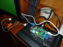
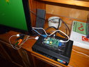
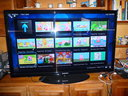

# Armando un Media Center con la Raspberry Pi y XBMC

Por su pequeño tamaño y su buena potencia, la Raspberry Pi es útil para todo tipo de soluciones each computing. Veremos como podemos utilizar nuestra Rasperry Pi para construir nuestra propia Media Center para convertir cualquier televisor en un Smart TV, con muchas funcionalidades similares a la Rocu, el Chrome Cast o el Apple TV.

Esta vez emplearemos nuestra [Raspberry Pi](http://www.raspberrypi.org/)  para construir un Media Center. Podemos integrar en una misma interfaz, el despliegue de videos y  multimedia de varias fuentes como la televisión y el Internet. Existe  un proyecto en Software Libre, que tiene esto como objetivo, llamado[ XBMC](http://xbmc.org/) y puede ser extendido mediante la programación de plugins en  Python.


## Componenetes del Media Center 

Para armar nuestra Media center necesitaremos los siguientes componentes o periféricos:

1. La Raspberry Pi, por supuesto.
2. Una memoria SD de 4Gb o más. Aunque algunas imágenes requieren 1Gb, 2Gb o hasta 4G como mínimo y preferiblemente de Clase 10. 
3. Un **transformador DC de 5v** con salida mini-USB.
4. Un **cable HDMI o RCA** para el televisor.
5. Opcionalmente un **teclado USB o inalámbrico** (con receptor USB). 
6. Opcionalmente un **mouse USB o inalámbrico** (con receptor USB).
7. Opcionalmente un cable RJ45 conectado al Switch o Hub para acceso a la red de datos o a Internet.
8. Opcionalemete un **Dungle Wifi USB**, para acceso a la red de datos o a Internet.
9. **Hub USB 4 puertos** nos permitirá incorpora una mayor número  de periféricos. 
10. Opcionalmente un **Pendrive** con videos y películas para ver en el Media Center. 

<aside>
[](../../images/robotics/Raspberry_Pi_P1020065.JPG)
</aside>


## Distros específicas para habilitar un Media Center con [XBMC](http://xbmc.org/)


Existe una buena [variedad de distribuciones](http://wiki.xbmc.org/index.php?title=Raspberry_Pi/FAQ#Installing_XBMC_on_the_Raspberry_Pi) especialmente orientada a convertir nuestra Raspberry en un Media Center con el XBMC ya pre-configurado, aunque ya  podemos [instalar XBMC en nuestro Raspbian](http://www.raspbian.org/RaspbianXBMC), aquí hay algunas de ellas:

- ***\*[OpenELE](http://www.openelec.tv/)\**:** No provee un imagen pre-configurada con un sistema de [instalación](http://wiki.openelec.tv/index.php?title=Installation), sin embargo, podemos encontrar las ultimas imágenes [aquí](http://openelec.thestateofme.com/). Es una de las más estables y optimizadas según los foros. Además cuenta con una sección de configuración bastante completa
- [Raspbmc](http://www.raspbmc.com/2013/02/raspbmc-hits-final/): La imagen ocupa unos 1.3. Cuenta con un [instalador](http://www.raspbmc.com/wiki/user/os-x-linux-installation/) hecho en Python, pero para Window. Al parece se mantiene bastante actualizada por lo que es la preferida de algunos. 
- [XBian](http://www.xbian.org/): Ofrece una image de unos 700Mb, la de menor tamaño de todos los que he evaluado, su [instalación](http://www.xbian.org/getting-started/install-and-connect/) es elemental. Levanta la aplicación XBMC como un servicio en el  arranque y carece de interface gráfica propia, ya que no se requiere si  funcionar como un Media Center. Esta es la razón de lo reducido que es la  distro. Es bastante rápida y ligera pero con es sencillo adaptar nuevo  hardware. 

En mi caso, para el momento de realizar el  experimento, solo contaba con una memoria SD de 1Gb. Por esta razón  decidí comenzar probando [XBian](http://www.xbian.org/). El proceso de instalación de la imagen es similar al descrito en el post [los primeros pasos con la raspberry Pi](../../posts/2021-05-23-primeros-pasos-con-la-raspberry-pi-modelo-b/). 

```bash
dd if=XBian1.0Alpha5.img of=/dev/disk1 bs=1m 
```

 

## Agregando nuevos componentes o addons al XBMC.  


Una vez seleccionado e instalado el sistema sobre nuestro Raspberry Pi y esperando que haya reconocido la conexión a  Internet, podemos instalar algunos componentes o Addons como los  siguientes:

1. Tv a la carta: Configura el acceso a canales de televisión de todo el mundo, disponibles en streaming vía Internet.
2. Videos a la carta: Maneja el acceso a canales de videos como Youtube, Vimeo, etc.
3. [Pelis a la carta](http://blog.tvalacarta.info/plugin-xbmc/pelisalacarta/instrucciones/instalacion-en-xbmc/): Configura fuentes de películas completas como Cuevana entre otros.


## Usando el Media Center.


Al terminar este proceso, que duró en mi caso, solo unos minutos, podemos  comenzar a utilizar el Media Center. Es bastante sencillo, aquí podemos  encontrar una [FAQ](http://wiki.xbmc.org/index.php?title=Raspberry_Pi/FAQ#Remotes_for_Raspberry_Pi) o un [manual](http://xbmcspain.com/foro/xbmc-desde-cero-macosx-t366.html) y [un tutorial](http://www.geektopia.es/es/technology/2012/04/08/articulos/xbmc-11-0-tutorial-de-puesta-en-marcha-y-configuracion-de-la-biblioteca.html), en el caso que deseemos profundizar en sus opciones. La [wiki de XBMC](http://wiki.xbmc.org/) es otra fuente de información muy completa 


| [](../../images/robotics/Raspberry_Pi_P1020063.JPG) | [](../../images/robotics/Raspberry_Pi_P1020064.JPG) | [](../../images/robotics/Raspberry_Pi_P1020066.JPG) |
| ------------------------------------------------------------ | ------------------------------------------------------------ | ------------------------------------------------------------ |
| [](../../images/robotics/Raspberry_Pi_P1020061.JPG) |                                                              |                                                              |


## Control remoto del XBMC. 

Tenemos varias formas de controlar remotamente nuestro Media Center.

1. **Teclado inalámbrico**. Tenemos una [guía de referencia](http://wiki.xbmc.org/index.php?title=Keyboard) para el uso de teclado en XBMC.
2. **Control infrarrojo** conectado al **GPIO IR receiver,** [aquí podemos ver como.](http://forum.stmlabs.com/showthread.php?tid=5549) Otra forma con un adaptador USB [así.](http://192.168.0.104/) 
3. **Control web**: El XBMC contiene un [simple servicio web](http://wiki.xbmc.org/index.php?title=Web_interface) para el control remoto por la red.
4. **Celulares o tableta**s a través de [varias aplicaciones](http://wiki.xbmc.org/index.php?title=Android_remotes) de Android como [esta](https://play.google.com/store/apps/details?id=org.xbmc.android.remote&hl=es). 


## Mis próximos proyectos con el Media Center - Raspberry Pi


**Smart-TV Pi**: La idea es construir un pequeño “Set Up Box” o decodificador para la  televisión digital abierta (TDA) pero con capacidad de integrar en un  mismo dispositivo, al estilo de un completo Media Center con XBMC, la  posibilidad de no solo ver Televisión, en nuestro televisor, sino  también reproducir películas desde un pendrive y ver videos desde  canales de internet como Youtube, Vimeo, Cuevana, etc, incluso ver  portales de redes sociales como Twitter y Facebook. Convirtiendo así, nuestro televisor convencional en un Smart-Tv.

**Control por reconocimiento de Rostros y formas**: Por la entrada USB de nuestra Raspberry Pi, podemos conectar una webCam y con la programación de un sistema de reconocimiento de patrones  basado en OpenCV, que luego podemos aplicarlo en el control remoto de nuestra Media Center