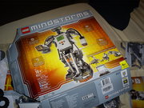
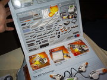
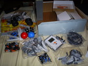
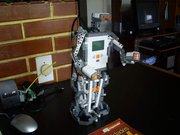

## Lego Mindstorm NTX v2.0

A primera vista tiene mucha semejanza con otros Legos Mechanics, sin embargo el [Lego Mindstorm](http://mindstorms.lego.com/en-us/default.aspx) trae buena cantidad de piezas moviles como engranajes, poleas, ruedas,  barras y en suma, más de 500 piezas de varios tamaños. Pero lo que  realmente nos permite construir robos con este juguete, son la piezas  que nos permiten introducir "inteligencia" a nuestros modelos así como  poder accionar movimientos en función de los estímulos del ambiente.

<aside>
  
</aside>

Estas piezas son los sensores, los efectores y un microprocesador, llamado  NXT sobre el que podremos programar las aplicaciones que controlarán  nuestros robots.

<aside>
    
</aside>

**Sensores:** 

- 2 sensores de contacto.
- 1 sensor de sonido.
- 1 sensor infrarrojo.
- 1 sensor de ultrasonido.

<aside>
    
</aside>

 **Efectores:**

- 3 servomotores. 

## El bloque NXT

Es la pieza principal del Lego Mindstorm v2.0.  Consiste fundamentalmente en una pieza que contiene un procesador de 32  bits y unas dimenciones de unos 4.6 x 15 x 15.1 pulgadas y pesa  4.6  libras. Tiene tres puertos de salida para conectar motores. Puertos A, B y C. y tiene cuatro puertos de entrada para conectar sensores. Puertos  1, 2,   3 y 4. Se conecta un cable USB y también se puede usar la conexión   inalámbrica Bluetooth para transferir datos. [Sus especificacione](http://www.julio.sandria.org/archivos/articulos/robotica/lego-nxt/introduccion/El_NXT.html)s son las siguientes:

- Microcontrolador 32-bit ARM7
- 256 Kbytes FLASH, 64 Kbytes RAM
- Microcontrolador 8-bit AVR
- 4 Kbytes FLASH, 512 Bytes RAM
- Comunicación inalámbrica Bluetooth (Bluetooth Clase II V2.0)
- 4 puertos de entrada, cable de 6 hilos
- 3 puertos de salida, cable de 6 hilos
- Pantalla gráfica LCD de 100 x 64 pixeles
- Bocina - 8 kHz calidad de sonido
- Fuente de poder: 6 baterías AA

 

## Mi primer Robot NXT

Unos de los modelos de robot que vienen en el manual es este bípedo que  construí durante la noche. En cuanto a funcionalidad, es bastante simple pero sirve para experimentas con las posibilidades de este Lego. Solo  mueve los brazos y "camina" (con algo de dificultad). la programación se realiza con el ambiente que trae en el CD, que es bastante simple y  fácil de usar. Sin embargo es demasiado básico (muy bueno para enseñas a programar a los niños)

<aside>
    
</aside>

Aquí les dejo un pequeño [vídeo](http://www.youtube.com/embed/MMXIg_qwfI0?rel=0&amp;fs=1&amp;wmode=transparent) que tome cuando lo terminé:

  <iframe
    src="https://www.youtube.com/embed/MMXIg_qwfI0"
    width="700"
    height="480"
    frameborder="0"
    allowfullscreen="">
  </iframe>

## Referencias

- http://mindstorms.lego.com/en-us/Default.aspx   (página oficial)
- http://www.bakati.com/s~q-lego-mindstorm.aspx  (tienda virtual)
- http://www.amazon.com/LEGO-4544091-Mindstorms-NXT-2-0/dp/B001USHRYI/ref=sr_1_1?ie=UTF8&qid=1297730139&sr=8-1  (tienda virtual)

## Ejemplos de algunos videos

- http://www.gadgetreview.com/2008/03/lego-solves-rubiks-cube-in-6-minutes.html   (robot que resuelve el cubo de rubic)
- http://www.maxmax.es/Lego-Mindstorm-NXT (algunas imágenes)
- http://www.youtube.com/watch?v=Mp8Y2yjV4fU  (robot que resuelve sudocus)
- http://www.youtube.com/watch?v=gXiql8Fm64A (varios ejemplos de robot)
- http://www.youtube.com/watch?v=aec-YxOw-28&feature=related (una araña)
- http://www.youtube.com/watch?v=ebfxYAUBw-0&feature=related (carro que estaciona de lado)
- http://www.youtube.com/watch?v=vaiJz7NFDOY&feature=related (robot que camina)
- http://www.youtube.com/watch?v=9dvTvNmiXNE&feature=related (otro robot que camina)

Parecen muy complicados pero se una forma divertida de  aprender a programar. El límite de los que se puede hacer con este  juguete esta en la imaginación.

Ahora debo buscar otras herramientas de programación que me permitan sacar el máximo provecho de este juguete y además hacerlos  desde mi sistema GNU/Linux.

 