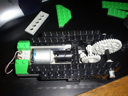
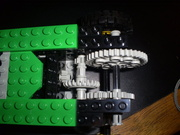

## Un Motor eléctrico de 5v 

Cualquier motor eléctrico de 5v como el que esta presente en muchos juguetes, es  una opción perfecta para ser incorporado en los modelos de robots. Basta con conectar las entradas eléctricas de motor a un par de tornillos  pequeños, de manera que sirvan para encajar con los cables conectores de lego. 

<aside>
     
</aside>

 

## Compensación de la fuerza y velocidad del motor

 

El problema que se presenta con esta adaptación es que el motor funciona  con un numero de revoluciones muy alto, al menos para los modelos que  queremos construir con ellos. La manera de resolverlo es adjuntar un  sistema de engranajes que disminuya la velocidad de giro mientras  aumenta su fuerza.Este mecanismo se muestra en la foto:

<aside>
     
</aside>

