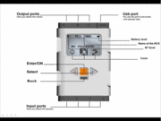
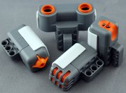

## Características de NXT

En [otro post](posts/2021-06-12-robots-hechos-con-lego-mindstorms-nxt/) comenté sobre las características y capacidades del bloque NXT, ahora  las repasaremos desde el punto de vista de sus potencialidades para  programarlo. Nuestro[ Lego Mindstorm](http://mindstorms.lego.com/en-us/default.aspx) viene con un ambiente de programación privativo y un lenguaje gráfico, basado en bloques, llamado NXT-G ([aquí algunos ejemplos](http://www.brickshelf.com/cgi-bin/gallery.cgi?f=191310) de programas NXT-G). El NXT-G es bastante amigable y una herramienta  ingeniosa para introducir a los niños en los conceptos de programación,  sin embargo, como dije antes, es privativo. Aquí podrán [descargar una guía rápida](http://ro-botica.com/img/NXT/pdf/NXT Guia Rapida-ES.pdf) de programación NXT-G, o [esta otra](http://www.hightechkids.org/?1-3-20-fll_programming_101_npl.pdf).

<aside>
    
</aside>
Para poder sacar el máximo de la capacidad de nuestros robots, aquellos que  somos aficionados a la programación, seguramente preferirán lenguajes de programación con más capacidad que la que puede ofrecer un diagrama  gráfico.
Antes que nada repasemos las características del bloque NXT:

<aside>

</aside>

-   32-bit Atmel AT91SAM7S256 main microcontroller (256 KB de memoria flash, 64 KB RAM)

-   Microcontrolador de 8-bit Atmel ATmega48 @ 4 MHz (4 KB de memoria flash , 512 Bytes RAM)

-   Patalla LCD de 100x64 pixel

-   Cuatro puertos de entrada de 6-pin (ports 1-4)

-   Tres puertos de salida de 6-pin (ports A-C)

-   Puerto USB

-   Bluetooth Class II V2.0

-   Loudspeaker - 8 kHz, 8-bit resolution, 2–16 kHz sample rate

-   Panel de 4 botones

    -   Anaranjado: On/Enter
    -   Flechas gris claro: moving left and right in the NXT menu
    -   Botón gris oscuro: Clear/Go back

-   Alimentación de corriente por 6 baterías AA o una bateria recargable DC NXT

-   Periféricos sensores:

    -   Sensor de Color (9694), para detectar 6 diferentes colores: azul, verde, rojo, amarillo, blanco, negro. Viene incluido con la nueva versión.
    -   Sensor de Luz (9844), para detectar niveles de luz. (incluido en la primera  versión, pero reemplazada por el sensor de color en la 2.0.
    -   Sensor de Tacto (9843), consiste en un simple botón que detecta si algo lo toca.
    -   Sensor de Ultrasonido (9846), para medir distancias usando hondas inaudibles de sonido.
    -   Sensor de Sonido (9845), para básicamente "escuchar": capaz de medir volumen pero no graba los sonidos.
    -   Sensor de Compas (MS1034), para la detección de la dirección. ha sido  construido con un calibrador que reduce la interferencia producida por  otros objetos magnéticos (No viene incluido en el kit básico).
    -   Sensor Acelerómetro (MS1040), para detectar en que dirección se mueve. también  puede medir la fuerza G, es decir, la de gravedad (No viene incluido en  el Kit básico).
    -   Sensor RF-ID, para comunicaciones entre múltiples robots (No viene incluido en el kit básico).
    -   Sensor de Rotación (incluido dentro de los servo-motores), para medir la  velocidad y angulo de giro. El cálculo se realiza en base a los dientes  de los engranares internos.

-   Periféricos actuadores:

    -   Servo Motor (9842).
    -   El Sensor de Color puede emitir una luz que utiliza como lampara para censar su reflejo.

Fuente: http://en.wikipedia.org/wiki/Lego_Mindstorms_NXT_2.0 

Estas especificaciones plantean la posibilidad de resolver la autonomía en un gran número de tareas para nuestros robots desde el propio NXT, sin  embargo, para cierto tipo de trabajos no, especialmente para aquellos en los que se requiere mayor capacidad de procesamiento, por ejemplo el  procesamiento de imágenes de video o para ciertos tipos de cálculos en  temas como Inteligencia Artificial. En estos casos seguirá siendo  necesario recurrir a la capacidad de computadores de escritorio o  servidores.

## Programación del NXT

Cuando abordamos el tema de programar nuestro NXT tenemos que tomar varias  cosas en cuenta antes de seleccionar el lenguaje y las herramientas de  desarrollo, como las capacidades del NXT y la compatibilidad de este con el lenguaje que deseamos utilizar. Para ciertos lenguajes es necesario  la actualización o el cambio del sistema operativo interno de la NXT  (firmware). Por ejemplo, para usar Java es necesario sustituir el  firmware original por el LejOS. 

En el caso de que no queramos modificar el sistema interno, es importante destacar que las funciones  del mismo son accesibles, tanto desde las aplicaciones internas como  desde los puertos de entrada/salida, como el USB y el Bluetooth. Esta  característica permite que, o bien los lenguajes de programación  empleados, deben generar en sus compilaciones, programas compatibles con el NXT y por tanto puedan ser cargados y ejecutados en el mismo  (*.rxe). O por otra parte, nuestros programas hagan uso de librerías  adecuadas para comunicarse con el NXT y por tanto, puedan ejecutarse  desde fuera del mismo. En el primer caso, obtendremos soluciones con  mucho mayor autonomía pero limitadas a las capacidades de procesamiento  de la NXT. En el segundo caso podremos aprovechar el uso computadores de mayor capacidad de procesamiento pero las limitaciones de movilidad y  autonomía que estas conexiones (Bluetooth o USB) impliquen.

## Opciones libres para la programación del NXT

Gracias al espíritu científico con el que fue conceptualizado y construido el [Lego Mindstorm](http://mindstorms.lego.com/en-us/default.aspx), sus creadores dispusieron suficiente información técnica como para la  proliferación de herramientas libres para el desarrollo sobre esta  plataforma, así como nuevos sensores y elementos electrónicos  compatibles con ella. A continuación haré un breve repaso de las  herramientas y lenguajes de desarrollo para la NXT:

- [**Enchanting**](http://enchanting.robotclub.ab.ca/tiki-index.php) es un ambiente gráfico de programación, basado en Scratch y  BYOB/Snap!, contiene conectores para la programación del NXT dentro del  ambiente del popular Scratch IDE.  
- [**leJOS NXJ**](http://en.wikipedia.org/wiki/LeJOS) es un lenguaje de alto nivel de fuentes abiertas y basado en Java.  Requiere de un firmware modificado desarrollado por el equipo de  leJOS. 
- [**BricxCC**](http://bricxcc.sourceforge.net/) (Bricx Command Center) de John Hansen, es un IDE para programar varias  versiones de bloque programables de LEGO, como el RCX y el NXT.  Actualmente incluye lenguajes como el NQC (Para el bloque RXC), el NBC  (Beta) y NXC (para el NXT). Lamentablemente solo está disponible para  Windows. Hasta ahora he podido hacerlo funcionar en GMU/Linux con Wine  pero sin comunicación directa con el NXT. 
- [**NQC**](http://bricxcc.sourceforge.net/nqc/) Not Quite C esta dirigido a programar el bloque RCX y uno de los pocos  que reemplaza el framework, utiliza como lenguaje de programación una  versión propia de C. Debe emular las instrucciones, haciendo que el  proceso sea más lento que por la metodología de reemplazar el firmware.  Funciona tanto en modo interpretado, para que sea ejecutado desde fuera, como en modo compilado para que sea cargado en el bloque. Not Quite C  esta disponible para Mac OS y Windows y Linux.
- [**NBC**](http://bricxcc.sourceforge.net/nbc/) (Next Byte Codes) es un languaje básico de código abierta con una  sintaxis de ensamblador que puede ser utilizado para programar el bloque NXT a bajo nivel. El ambiente BricxCC también tiene la capacidad de  des-compilar los archivos ejecutables estándar .rxe hacia codigo NBC.
- [**NXC**](http://bricxcc.sourceforge.net/nbc/) (Not eXactly C) es un lenguaje de alto nivel similar a C, construido  sobre el compilador NBC, por lo que también puede ser utilizado para  programar el bloque NXT. NXC is basicamente NQC para el NXT. es uno de  los más ampliamente usados por otros lenguajes de programación para el  NXT. Es posible, hasta crear videojuegos para el NXT.
- [**pbLua**](http://www.hempeldesigngroup.com/lego/pbLua/) es un port de el lenguaje de programación Lua, consiste en un lenguaje  interpretado de propósito general, para que el Lego Mindstorms. lo pueda ejecutar requiere de un firmware propio.
- [**PyNXC**](http://code.google.com/p/pynxc/) en un proyecto que convierte código Python en código binario NXC "Not  Exactly C", que luego puede ser cargado en nuestros Robots del Lego  Mindstorm.
- [**BrickTool**](http://bricxcc.sourceforge.net/utilities.html) por John Hansen es un utilidad basada en Bluetooth para las comunicaciones entre el PC y el bloque NXT. 
- [**ICommand**](http://lejos.sourceforge.net/) por Brian Bagnall: es un API de Java API para controlar remotamente el bloque Lego NXT. 
- [**NXT#**](http://nxtsharp.fokke.net/) por Bram Fokke es una librería para controlar el Lego Mindstorms NXT para .NET.
- [**NXT Perl API**](http://nxt.ivorycity.com/) por Michael Collins es una capa de control del NXT escrita en Perl**. 
  
  **
- **[\**Ruby-nxt\**](http://ruby-nxt.rubyforge.org/)** es una librería para controlar el NXT remotamente usando Ruby. 
- **[\**LibNxt\** ](http://nxt.natulte.net/trac/wiki/LibNxt)**por David Anderson es una librería de comunicación entre el PC y el bloque NXT escrita en C.
- **[\**Nxt-Python\**](http://code.google.com/p/nxt-python/)**es una librería Python para el control de Robots Lego Mindstorms NXT,  permite la comunicación con el NXT tanto por via USB como por Bluetooth. Soporta comandos directos y una gran variedad de sensores adicionales  de terceros. 
- [**T2N**](http://www-verimag.imag.fr/~raymond/edu/lego/t2n/) (Talk to NXT) es una herramienta por línea de comandos para transferir  programas ejecutables y archivos de datos entre el PC y el bloque NXT 

 

## Otros lenguajes privativos para el NXT

- [**Robotics Studio by Microsoft.**](http://msdn.microsoft.com/en-us/robotics/default.aspx)
- **Robolab**. 
- [**RoboMind**](http://en.wikipedia.org/wiki/RoboMind). 
- [**RobotC**](http://www-education.rec.ri.cmu.edu/robotc/index.html). 
- [**MATLAB y Simulink**](http://en.wikipedia.org/wiki/MATLAB).

###  

## Conclusiones

Hay una amplia variedad de alternativas para programar los robots de Lego.  Pienso que, a menos que sean amantes de Java (que no es mi caso), no  hace falta sustituir el firmaware original para programar nuestros  robots y sacarles el máximo provecho. 

A mi juicio las grandes alternativas para la programación del Lego Minstorm NXT son Python y  C/C++, ya sea para crear ejecutables nativos (*.rxe) para el bloque NXT  con [PyNXC](http://code.google.com/p/pynxc/) o [NQC](http://bricxcc.sourceforge.net/nqc/), o para compilar aplicaciones que se ejecuten el PC y se comuniquen con el NXT (por USB o Bluetooth) con [nxt-python](http://code.google.com/p/nxt-python/) o con [LibNxt](http://nxt.natulte.net/trac/wiki/LibNxt), en Python y C/C++ respectivamente.

En varios post anteriores muestro como [controlar un carro robot con python](/posts/2021-05-30-vehiculo-robot-con-lego/), y [desde una "canaimita"](http://192.168.0.104/personalweb/index.php/robotica/52-lego-mindstorm/78-carro-robot-controlado-desde-una-qcanaimitaq) este es uno de los videos:

  <iframe
    src="https://www.youtube.com/embed/NJB58nQxAxk"
    width="700"
    height="480"
    frameborder="0"
    allowfullscreen="">
  </iframe>

## Algunos enlaces y fuentes relacionadas

- http://blog.electricbricks.com/es/2009/09/lenguajes-programacion-nxt/
- http://www.teamhassenplug.org/NXT/NXTSoftware.html
- http://mindstorms.lego.com/en-us/default.aspx
- http://ro-botica.com/mindstorms_sys.asp
- http://www.philohome.com/nxt.htm
- http://es.wikipedia.org/wiki/Lego_Mindstorms
- http://en.wikipedia.org/wiki/Lego_Mindstorms_NXT
- http://en.wikipedia.org/wiki/Lego_Mindstorms_NXT_2.0