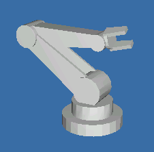
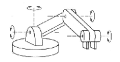
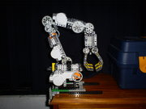
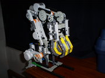
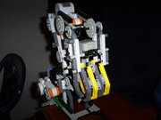
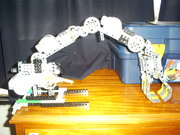

## Brazo articulado.

El brazo robot de tipo articulado, es uno de los más complejos debido a la cantidad de movimientos que pueden realizar y, por tanto, el número de  tareas que pueden desempeñar. Su configuración es similar a la del brazo humano y esta constituido por dos secciones rectas que corresponderían  al brazo y el antebrazo humano y que a su vez están montados sobre un  pedestal giratorio. Estos componentes están conectados entre sí por dos articulaciones giratorias que corresponderían al hombro y al codo  respectivamente. Una muñeca esta unida al extremo del antebrazo, con lo que se suman a la estructura varias articulaciones más con la intención de permitir o facilitar el posicionamiento y la orientación de la  herramienta.

 <aside>
     
 </aside>

## Funcionamiento del brazo articulado.

Todos los robots del tipo industrial están diseñados para realizar trabajo  productivo. Este trabajo se realiza mediante el desplazamiento de las  diferentes partes que constituyen el cuerpo del robot, a saber: su  cuerpo, brazo, muñeca y efector final, a estos elementos los llamaremos  segmentos . Los punto de articulación entre cada una de los segmentos,  es decir, la base, el hombro, codo y muñeca, se corresponde con los  puntos de rotación que le dan al robot sus grados de libertad. El robot  articulado posee 4 grados de libertad y cada uno de los cuales requiere  de un motor independiente. Esto sin contar con el motor que accione el  abrir y cerrar de la mano. 

 <aside>
     
 </aside>

 

## Construcción del brazo robot. 

Luego de varios intentos para lograr un poco de estabilidad, cosa difícil de  lograr debido al peso de los motores, llegue a un modelo estable. Debido a que el bloque NXT solo cuenta con 3 salidas para el control de  efectores, como motores, la pruebas solo se pudieron hacer por partes.  Por una parte, experimentos con las articulaciones de brazo: hombro,  codo y mucheca. Y por otra el movimiento de la base y el de la mano. A  continuación, algunas imágenes:

 

 

## Conclusiones.

Aunque se logro un modelo en tamaño y movimientos similar a lo deseado, el  peso de los motores hace difícil el control del los movimientos. Esto se podría resolver optimizando la posición de los motores transfiriendo el trabajo a la base y utilizando ejes y cardanes. Otra posibilidad es  utilizar contrapeso en los diferentes ejes aunque esto traiga como  consecuencia la reducción de la movilidad.

Otro problema fue la  cantidad de motores necesario para obtener todos lo grados de libertad  deseados. Como mencione anteriormente el bloque NXT solo contiene 3  salidas y para este proyecto se requieren, al menos cinco. Una posible  solución es construir o adquirir un multiplexor para los motores del NXT ([como este por ejemplo](http://www.mindsensors.com/index.php?module=pagemaster&PAGE_user_op=view_page&PAGE_id=134)) 

