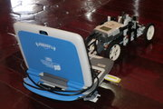
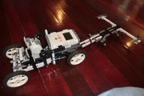

## El computador "Canaima" 

 

"[Canaima Educativo](http://www.canaimaeducativo.gob.ve/index.php?option=com_content&view=category&id=44&layout=blog&Itemid=92)" es un proyecto del Gobierno Bolivariano que tiene por objetivo apoyar  la formación integral de las niñas y los niños, mediante la dotación de  una computadora portátil escolar con contenidos educativos a los  maestros y estudiantes del subsistema de educación primaria conformado  por las escuelas públicas nacionales, estadales, municipales, autónomas y las privadas subsidiadas por el Estado".(Fuente:  http://www.canaimaeducativo.gob.ve).

<aside>
[](../../images/robotics/carrorobot_cimg7022.jpg)    
</aside>

​    

## Incorporando el Canaimita en el carro robot

 

Para incorporar y conectar el computador, voy a adaptar un pequeño remolque  que soporte el peso del mismo. Como lo he mencionado en otro post, aun  no he logrado conectar, vía Bluetooth, las aplicaciones hechas con  nxt-python al computador por lo que debo recurrir a la conexión USB. Por otro lado, aunque presidiera de la conexión USB y utilizara la  Bluetooth, esta ultima tiene mucho menos alcance que una WiFi. Teniendo  el computador adjunto al robot, podemos controlarlo en todo un edificio o galpón industrial, vía red inalambrica (WiFi). 

<aside>
[](../../images/robotics/carrorobot_cimg7014.jpg)        
</aside>


## Controlando a distancia nuestro robot.


EL control remoto del robot fue implementado mediante el uso de una  pantalla remota desde un computador portatil conectado a la Canaimita  remolcada por el robot, vía WiFi. La conexión inalambrica se estableció  mediante una configuración adhoc para poder prescindir del access  point.Para establecer esta conexión utilice la siguiente configuración:

```bash
\#iwlist wlan0 scan
ifconfig wlan0 down
sleep 2
iwconfig wlan0 mode Ad-Hoc
iwconfig wlan0 essid 'robotland'
iwconfig wlan0 channel 10
iwconfig wlan0 rate auto
iwconfig wlan0 ap any
ifconfig wlan0 up
ifconfig wlan0 192.168.1.2
route add default wlan0
/sbin/dhcpcd -t 60 wlan0 &
```

Como se puede ver, establece una red llamada "robotland" en el canal 10.  Podemos ver que canales estan disponibles en nuestro entorno con el  comando "iwlist wlan0 scan". El dispositivo utilizado es wlan0, pero  puede variar de computador en computado. Por ultimo, la dirección IP  asignada al equipo Canaimita fue 192.168.1.1 y al equipo remoto  192.168.1.2. A continuacion podemos ver una muestra del movimiento de  nuestro robot controlado por una netbook Canaimita:

<div class="embed-container">
  <iframe
    src="https://www.youtube.com/embed/c3hgV1xzBFc"
    width="700"
    height="480"
    frameborder="0"
    allowfullscreen="">
  </iframe>
</div>


La aplicación de control empleada es la descrita en el post sobre el [carro robot](http://192.168.0.104/personalweb/index.php/robotica/52-lego-mindstorm/77-carro-robot-de-proposito-general), y podemos usarla a través de una sesión ssh. Por otro lado aprovechamos la cámara web integrada en la Canaimita para mostrar en vídeo la vista  desde el carro a lo largo de sus movimientos:

<div class="embed-container">
  <iframe
    src="https://www.youtube.com/embed/8yqqVgX1F_I"
    width="700"
    height="480"
    frameborder="0"
    allowfullscreen="">
  </iframe>
</div>


