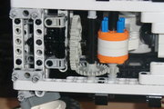
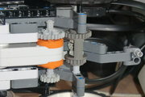
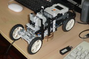

## Sistemas de dirección y tracción.


Un subsistema importante en la construcción de robot son los sistemas de  dirección. En principio nos deben permitir controlar el giro del robot  con un solo motor. Para nuestro pequeño modelo utilice un sistema  modificado basado en el "[Compact pendular steered suspension](http://sariel.pl/2008/12/compact-pendular-steered-suspension/)" que utiliza engranajes de palanca y sin amortiguación (dado que aun no tengo amortiguadores). Aquí podemos ver una demostración en [video del  funcionamiento de este sistema](http://www.youtube.com/embed/P2aO72b3ij0?rel=0&amp;fs=1&amp;wmode=transparent): 

<aside>
[](../../images/robotics/carrorobot_cimg7010.jpg)    
</aside>


<div class="embed-container">
  <iframe
    src="https://www.youtube.com/embed/P2aO72b3ij0"
    width="700"
    height="480"
    frameborder="0"
    allowfullscreen="">
  </iframe>
</div>  


Con respecto al sistema de tracción, podría haber utilizado dos motores,  como lo hace muchos modelos parecidos a este, pero he preferido  restringir el uso de los motores para poder disponer de ellos en otros  experimentos, de hecho, uno de los posibles usos de este modelo sera  llevar consigo un brazo robot. Una de las cosas a tomar en cuenta cuando utilizamos un solo motor en el sistema de tracción de nuestro  vehículos, es que cuando el mismo gira, las ruedas traseras derecha e  izquierda llevan velocidades diferentes. Eso podría ocasionar el  rompimiento del eje o de alguno de los engranajes. Para evitar esto  utilizamos un diferencial.

<aside>
[](../../images/robotics/carrorobot_cimg7011.jpg)        
</aside>


A continuación podemos ver los sistemas de dirección y de tracción funcionando en un breve [vídeo de pruebas](http://www.youtube.com/embed/TLziwawBW-4?rel=0&amp;fs=1&amp;wmode=transparent):

<div class="embed-container">
  <iframe
    src="https://www.youtube.com/embed/TLziwawBW-4"
    width="700"
    height="480"
    frameborder="0"
    allowfullscreen="">
  </iframe>
</div>  


## Programación de carro robot con software libre.

Algunos de los inconvenientes del sistema NXT son su capacidad de procesamiento y que no trabaja con números punto flotante, al menos al utilizar el  firmware original. Esto es especialmente malo si queremos experimentar  con redes neuronales o procesamiento digital de imágenes en visión  artificial para el control de nuestro robot. Una manera se superar estos problemas es controlar el robot desde un computador y es así  precisamente como funciona el [nxt-python](http://code.google.com/p/nxt-python/). Los programas hechos con esta librería corren en el computador y no en  el NXT, por tanto aprovechan todas las capacidades de nuestro PC, pero  además pueden leer el valor de los sensores así como activar los  motores. Aquí podemos revisar algunas referencias sobre el nxt-python:

<aside>
[](../../images/robotics/carrorobot_cimg7003.jpg)        
</aside>
- http://code.google.com/p/nxt-python/
- http://home.comcast.net/~dplau/nxt_python/
- http://pypi.python.org/pypi/nxt-python/2.2.1
- http://www.fing.edu.uy/inco/cursos/fpr/wiki/index.php/API_nxt-python

Para nuestro primer programa con [nxt-python](http://code.google.com/p/nxt-python/) hice un sistema de control, por teclado, desde el computador. Dado que  las operaciones estándar de entrada por teclado en el python requieren  presionar la tecla Enter, me apoyo en la librería [console_io](http://www.iearobotics.com/personal/juan/proyectos/python/pyconsola_io/pyconsola_io.html)  para poder accionar las funciones del robot instantáneamente al  presionar ciertas teclas. La operaciones implementadas son Cruce a la  derecha ("k") y a la izquierda ("h"), avanzar ("j") y retroceder ("m").  Para detener se puede utilizar la tecla ESC o "s" y el "espacio" para  mostrar el menú de nuevo:

```python
#!/usr/bin/env python
import nxt.locator
from nxt.motor import *
import consola_io

def menu():
 print """ 
   Menu de opciones
   \----------------
   
   1.-  Derecha  k
   2.-  Izquierda  h
   3.-  Avanzar  j
   4.-  Retroceder  m   
   SP.- Mostrar menu
   ESC.- Terminar s
 """
 
def derecha(b):
  motor_direccion = Motor(b, PORT_B)
  if Direc[0] - Direc[1] >= -180:
    Direc[0] = Direc[0] - Direc[1]
    motor_direccion.turn(-80, Direc[1])
  print "Derecha", Direc[0]
  
def izquierda(b):
  motor_direccion = Motor(b, PORT_B)
  if Direc[0] + Direc[1] <= 180:
    Direc[0] = Direc[0] + Direc[1]
    motor_direccion.turn(80, Direc[1])
  print "Izquierda", Direc[0]

def avanzar(b):
  motor_traccion = Motor(b, PORT_C)
  if Trac[0] + Trac[1] <= 100:
    Trac[0] = Trac[0] + Trac[1]
    if Trac[0] != 0:
      motor_traccion.run(Trac[0])
    else:
      motor_traccion.idle()
  print "Avanzar", Trac[0]
  
def retroceder(b):
  motor_traccion = Motor(b, PORT_C)
  if Trac[0] - Trac[1] >= 0:
    Trac[0] = Trac[0] - Trac[1]
    if Trac[0] != 0:
      motor_traccion.run(Trac[0])
    else:
      motor_traccion.idle()
      
  print "Retroceder", Trac[0]

def detener(b):
  motor_traccion = Motor(b, PORT_C)
  Trac[0] = 0
  motor_traccion.idle()
  print "Detener", Trac 

#---------------------
#- Comienzo programa
#---------------------
#  thread.start_new_thread(thread_direction,("Thread No:1",2))
#  thread.start_new_thread(thread_traction,("Thread No:1",2))
Direc = [0, 60]
Trac = [0, 50]
b = nxt.locator.find_one_brick()
#-- Sacar menu
menu()
#-- bucle principal
while 1:
  #-- Leer tecla
  c = consola_io.getkey()
  #-- Procesar tecla
  if  c=='k': 
    derecha(b)
  elif c=='h': 
    izquierda(b)
  elif c=='j': 
    avanzar(b)
  elif c=='m': 
    retroceder(b)
  elif c=='n': 
    retroceder(b)
  elif c==' ': 
    detener(b)
    menu()
  elif c=='s': 
    detener(b)
    break  #-- Salir del bucle
#-- Terminar 
print "-- FIN --"
```

En teoría la librería nxt-python permite que le computador se conecte  con el NXT vía USB o Bluetooth, pero esta segunda opción no me ha  funcionado hasta ahora. Aquí les dejo un ejemplo del funcionamiento del programa de control por teclado:

<div class="embed-container">
  <iframe
    src="https://www.youtube.com/embed/NJB58nQxAxk"
    width="700"
    height="480"
    frameborder="0"
    allowfullscreen="">
  </iframe>
</div>  


