## Lego TriBot como robot de pruebas

En vista del interés que mi hija de 3 años ha presentado en jugar con su  Lego Duplo y su habilidad en el manejo de la tableta, decidí, construir  un pequeño robot con el que pudiera interactuar, ya sea para controlarlo desde la tableta y para agarrar objetos y moverlos. 

<aside>

</aside>

Hay un modelo bastante simple llamado [Tribot](http://mindstorms.lego.com/en-us/support/buildinginstructions/8527-/Tribot.aspx) y cuyas instrucciones podemos [descargar](http://192.168.0.104/personalweb/archivos/Tribot_PDF.pdf) de internet. Este robot debe su nombre a que posee solo 3 ruedas, dos  delanteras controladas por servos independientes y una trasera de libre  movilidad. 

Algunas imágenes de como quedó:

| [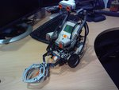](../../images/robotics/img_20130818_204508.jpg) | [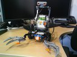](../../images/robotics/img_20130822_084715.jpg) | [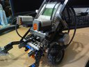](../../images/robotics/img_20130822_084732.jpg) |
| ------------------------------------------------------------ | ------------------------------------------------------------ | ------------------------------------------------------------ |
| [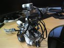](../../images/robotics/android_img_20130822_084750.jpg) | [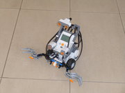](../../images/robotics/android_p1030458.jpg) | [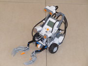](../../images/robotics/android_p1030459.jpg) |

Aquí unos breves videos de su funcionamiento: 

  <iframe
    src="https://www.youtube.com/embed/ik6-wHk5WvU"
    width="700"
    height="480"
    frameborder="0"
    allowfullscreen="">
  </iframe>

  

  <iframe
    src="https://www.youtube.com/embed/DaJMqKevv1E"
    width="700"
    height="480"
    frameborder="0"
    allowfullscreen="">
  </iframe>

  

## Aplicaciones Android para controlar nuestro robot

 

En la tienda de [Google play](https://play.google.com/store/search?q=nxt) de aplicaciones Andorid podemos encontrar una gran cantidad de  programas desarrollados para el control de robot desde dispositivos  móviles. En este conjunto de programas se incluyen algunos que son  software libre y con unas funcionalidades bastante completas. La  principal ventaja de estas aplicaciones es que no necesitamos programar  nuestro robot, dado que la mayoría de ellas, hacen uso de funciones  propias del NXT para su control, con lo cual, podemos empezar a probar  tan pronto como esté contruido. Es este apartado intentaré hacer una  revisión sobre algunos de estas aplicaciones. 

<aside>
[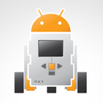](../../images/robotics/android_tn_img_20130821_062020.jpg)
</aside>

## NXT Remote Control

[NXT Remote Control](https://play.google.com/store/apps/details?id=org.jfedor.nxtremotecontrol) es un aplicación de software libre (GPL, [aquí la página del proyecto](http://code.google.com/p/nxt-remote-control/) en Google Code) que esta orientada básicamente al control del  movimiento del robot de forma remota, a través de varias interfaces de  control. Estas funciones de control incluyen el avanzar, retroceder,  girar a la izquierda y a la derecha. En una de las interfaces (3  motores) se permite adicionalmente, controlar la tenaza delantera. Las  interfaces incluidas contemplan:

<aside>
 
</aside>

1. Interfase de control a botones. 
2. Interfase de orientación por control de angular y radial
3. Interfase de control independientes de 2 y 3 motores

Aquí podemos versus pantallas: 

| A botones:                                                   | Angular:                                                     | A 3 motores:                                                 |
| ------------------------------------------------------------ | ------------------------------------------------------------ | ------------------------------------------------------------ |
| 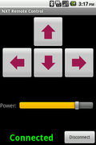 | 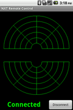 | 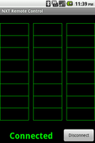 |

### NXT Controller Plus

[NXT Controller Plus](https://play.google.com/store/apps/details?id=com.nxtcontrollerplus) es otra aplicación de software Libre (GPL, [aquí la página del proyecto](http://192.168.0.104/personalweb/ http://code.google.com/p/nxtcontrollerplus/) en Google Code), que permite el control del movimiento del robot por  orientación angular y radial. Adicionalmente registra visualmente las  entradas de los sensores conectados a NXT. Tiene una pantalla de  configuración bastante simple y completa. Bastante útil para probar el  comportamiento del robot y sus sensores.

<aside>

</aside>

Aquí les muestro un par de pantallas tomadas de la pagina Google Play:

[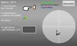](../../images/robotics/nxt_controller_plus_01.jpg) [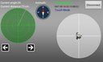](../../images/robotics/nxt_controller_plus_02.jpg)

 

### MINDdroid

[MINDdroid](https://play.google.com/store/apps/details?id=com.lego.minddroid) es una aplicacion de software libre (GPL,[aquí la página del proyecto](https://github.com/NXT/LEGO-MINDSTORMS-MINDdroid) en Github) y fue desarrollada y [presentada](http://mindstorms.lego.com/en-us/news/readmore/default.aspx?id=227417) por los mismos representantes del [Lego Mindstom](http://mindstorms.lego.com/en-us/news/readmore/default.aspx?id=227417). Aparte del control directo de los motores tanto por el método  angular/radial como por el posicionamiento de la tableta, a través del  uso de su acelerómetro. Otro elemento interesante de esta aplicación es  que permite ejecutar programas cargadas en el NXT remotamente y hacer  upload de nuevas programas, con lo que se tiene un control bastante  completo del robot sin la necesidad de manejarlo de forma directa desde  el panel del la NXT.

<aside>
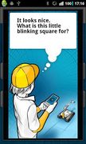
</aside>

## Aplicaciones android 

Aquí les dejo una lista de algunas aplicaciones android para el control de movimiento de robots  

Estas son aplicaciones que me han parecido ingeniosas en el Google Play, pero que aunque son gratis, no son software libre, por lo que no podemos  estudiar el como fueron construidas, y por tanto, carecen de interés  científico: 

- [Remote NXT](https://play.google.com/store/apps/details?id=logicgate.remotenxt)
- [NXT GSensor Remote](https://play.google.com/store/apps/details?id=NXT.GSensor): Este programa realiza el control del robot mediante el movimiento de la tableta o el celular mediante el empleo de su acelerómetro.
- [NXT Simple Remote](https://play.google.com/store/apps/details?id=NXT.Simple): Otra aplicación para el control de movimiento.
- [NXT Numeric Remote](https://play.google.com/store/apps/details?id=NXT.BTNumeric): Otra aplicación para el control de movimiento con un teclado numérico.
- [NXT Drive](https://play.google.com/store/apps/details?id=appinventor.ai_idomarko1998.NXTDrive) 
- [Controle Bluetooth Lego NXT](https://play.google.com/store/apps/details?id=appinventor.ai_tarikcaramanico.NXTcontrol) 
- [Mindstorms Control Car](https://play.google.com/store/apps/details?id=appinventor.ai_drewmyles15.app) 
- [NXT CONTROL REMOTO REVIEW](https://play.google.com/store/apps/details?id=appinventor.ai_ikstarr.NXT_REMOTE_CONTROL_REVIEW) 
- [Robot Lego ATC NXT](https://play.google.com/store/apps/details?id=com.gipsyz.atclego): Control de robots por voz.
- [NXT Speech Control: ](https://play.google.com/store/apps/details?id=appinventor.ai_sebastian_trella.NXT_Sprachsteuerung_free)Control de robots por voz.
- [HiTechnic Segway Remote](https://play.google.com/store/apps/details?id=appinventor.ai_mbbackus.HTWayAR) 
- [LEGO NXT Face Follower ](https://play.google.com/store/apps/details?id=robotAppStore.LegoNXTFaceTrackerFree)
- [NXT Messenger](https://play.google.com/store/apps/details?id=com.bytemesoftware.nxtmessenger) 
- [Stream-O-Bot ](https://play.google.com/store/apps/details?id=edu.snc.android.mindstorm)
- [Blue Tooth R2D2](https://play.google.com/store/apps/details?id=com.olaochelliot.androidlego.segolawaycontrol) 

## Referencias de nuevos proyectos:

Aquí dejo algunos enlaces a blogs sobre proyectos de robótica 

- http://www.nxt-code.com/
- http://blog.electricbricks.com/