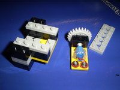
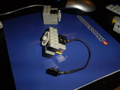

## Insumos para la construcción del sensor de ángulo.

Los sensores que maneja el RCX y el NXT son analógicos y básicamente se  manejan por señales que se miden el voltios dentro del rango 0 volt a 5  volt. Para la construcción de nuestro sensor de ángulos nos basaremos en la adaptación de una resistencia variable del tipo de manivela. Otro  insumo serán dos pequeños tornillos que no servirán como contactos para  el cable de conexión con el RCX. 

<aside>
     
</aside>

## Conexión con el bloque RCX o NXT. 

Para conectar nuestro nuevo sensor al bloque RCX basta con conectar  cualquier cable de conexión a una de las entradas de sensores de bloque  RCX. Para el caso del bloque NXT recomiendo utilizar el cable conversor [8528](http://mindstorms.lego.com/en-us/products/default.aspx#8528) y utilizar el sensor de giro como si fuese un sensor de luz. 

<aside>
    
</aside>

