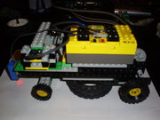
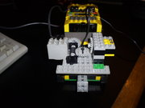
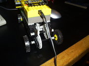

## Construcción del robot


La construcción de carro robot requiere de dos motores y un sensor de luz  infrarroja. En vista de que uno de los motores ese dañó hace algún  tiempo,he tenido que adaptar un motor de 5v para este experimento. Uno  de los motores se utilizará para controlar el sistema de dirección y el  otro para el de tracción. El sensor se coloca adjunto al sistema de  dirección para al detectar el umbral adecuado de luz que identifique la  linea negra, la posición actual indicará la dirección en la cual deba  moverse el carro. Para tener retroalimentación del ángulo de giro,  adaptaremos un nuevo sensor de giro construido por mi mismo.

<aside>
[](../../images/robotics/linetracking_rcx_s5030714.jpg)    
</aside>


[](../../images/robotics/linetracking_rcx_s5030569.jpg)[](../../images/robotics/linetracking_rcx_s5030570.jpg)

 

## Programación del comportamiento del robot


Para la lógica del comportamiento del robot, he decidido usas el lenguaje  NQC, similar a C, multiplataforma, y funciona sobre firmware original  del bloque RXC.Aquì dejo algunos enlaces sobre este lenguaje:

- http://bricxcc.sourceforge.net/nqc/
- http://es.wikipedia.org/wiki/NQC 
- http://www.donosgune.net/2000/gazteler/prg_leng/NQCgaz.htm 

Se requirió algo de experimentación para identificar los valores adecuados para el umbral que separa la detección de la linea negra de lo que no  lo es, también para la identificación de los umbrales de seguridad para  el giro de las ruedas en el sistema de dirección. A continuación dejo el código del sistema de control del carro robo:

```c
\#define UMBRAL_DER 605 
\#define UMBRAL_IZQ 765 
\#define CENTRO 690 
\#define UMBRAL_LUZ 40 
\#define IZQ 1 
\#define DER 2 
int velocidad, __velocidad, direccion; 
 
task marcha() 
{ 
 while (true) 
 { 
  __velocidad = velocidad; 
  if (__velocidad > 0) {Fwd(OUT_A);} 
  if (__velocidad < 0) {Rev(OUT_A); __velocidad = -__velocidad;} 
  On(OUT_A); 
  Wait(__velocidad); 
  Off(OUT_A); 
 } 
} 
 
task cruce_der() 
{ 
 direccion = DER; 
 Fwd(OUT_B); 
 while (SENSOR_1 > UMBRAL_DER) 
 { 
  On(OUT_B); 
  Wait(1); 
  Off(OUT_B); 
 } 
} 
 
task cruce_izq() 
{ 
 direccion = IZQ; 
 Rev(OUT_B); 
 while (SENSOR_1 < UMBRAL_IZQ) 
 { 
  On(OUT_B); 
  Wait(1); 
  Off(OUT_B); 
 } 
} 
 
 task buscar() 
{ 
 int dir = direccion; 
 while (true){ 
  if ( dir == DER ){ 
   start cruce_der; 
   Wait(200); 
   start cruce_izq; 
   Wait(200); 
  } else { 
   start cruce_izq; 
   Wait(200); 
   start cruce_der; 
   Wait(200); 
  } 
  if ( dir == DER ){ 
   start cruce_izq; 
   Wait(200); 
   velocidad = -50; 
   start marcha; 
   Wait(30); 
   stop marcha; 
   velocidad = 10; 
   Off(OUT_A); 
  } else { 
   start cruce_der; 
   Wait(200); 
   velocidad = -50; 
   start marcha; 
   Wait(30); 
   stop marcha; 
   velocidad = 10; 
   Off(OUT_A); 
  } 
 
/*  velocidad = -50; 
  start marcha; 
  Wait(50); 
  stop marcha; 
  velocidad = 50;*/ 
 } 
} 
 
task main() 
{ 
 velocidad = 10; 
 direccion = DER; 
 SetSensor(SENSOR_2,SENSOR_LIGHT); 
 SetSensorMode(SENSOR_1, SENSOR_MODE_RAW); 
 SetDirection(OUT_A, OUT_FWD); 
 SetPower(OUT_A, 7); 
 SetDirection(OUT_B, OUT_FWD); 
 SetPower(OUT_B, 5); 
 start marcha; 
// Wait(500); 
// Off(OUT_A); 
// stop marcha; 
 while (true) 
 { 
  if (SENSOR_2 > UMBRAL_LUZ) 
  { 
   stop marcha; 
   Off(OUT_A); 
   start buscar; 
   until (SENSOR_2 <= UMBRAL_LUZ) Wait(20); 
   stop buscar; 
   stop cruce_izq; 
   stop cruce_der; 
   Off(OUT_B); 
   velocidad = 10; 
   start marcha; 
  } 
  velocidad = 10; 
 } 
 
/* start marcha; 
 Wait(300); 
 stop marcha; 
 Off(OUT_A); 
 start cruce_der; 
 Wait(300); 
 start cruce_izq; 
 Wait(300); 
 start cruce_der; 
 Wait(300); 
 start cruce_izq; 
 Wait(300); 
 start cruce_der; 
 Wait(300); 
 start cruce_izq; 
 Wait(100); 
*/ 
  
} 

```

 

## Una breve demostración

 

Aquí dejo un pequeño video. Pido disculpas por la calidad pero fue tomado con el célular. 


<iframe src="http://www.youtube.com/embed/ZwReO_9vxR8?rel=0&amp;fs=1&amp;wmode=transparent" allowfullscreen="" title="JoomlaWorks AllVideos Player" width="400" height="300" frameborder="0"></iframe>


 

## Conclusiones

 

La lógica de control funciona bastante bien en general excepto para los  caso de giros muy pronunciados. Para resolver este problema se podría  modificar el modelo del carro de manera de permitir un mayor rango de  giro de la ruedas delanteras. 

 


