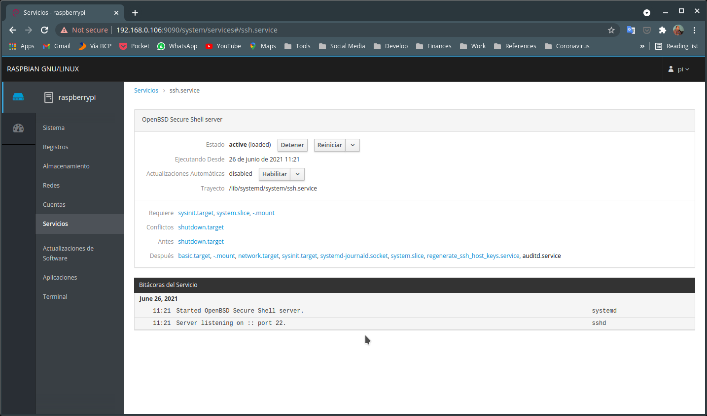

## Descarga del sitema operativo 

Vamos utilizar el [Raspberry Pi OS](https://www.raspberrypi.org/software/operating-systems/) , hay varias versiones, en mi caso usaré la  *Lite*, sin entorno gráfico porque la quiero manejar desde la red, aunque en todos los casos el procedieminto es el mismo:

```bash
wget https://downloads.raspberrypi.org/raspios_lite_armhf/images/raspios_lite_armhf-2021-05-28/2021-05-07-raspios-buster-armhf-lite.zip .
unzip 2021-05-07-raspios-buster-armhf-lite.zip
```

## Instalando la imagen en la SD card:

Asumiendo que la SD card se identifica por /dev/mmcblk0 (lo podemos verificar con el commando *fdisk -l*), el comando sería así:

```bash
sudo dd if=2021-05-07-raspios-buster-armhf-lite.img  of=/dev/mmcblk0 bs=4M conv=fsync
```

## Iniciando el sistema

Luego de colocar la SD card en la Raspberry y encenderla,entramos con el usuario y password por defecto (que luego podemos cmbiar con *passwd*)

- Login: pi
- password: raspberry

Luego vamos a configurar la red y actualizamos la lista de repositorios:

```bash
sudo raspy-config
sudo apt-get update
```

## Problema del MAC address Randomization

Para evitar el problema de MAC address aleatoria y poder fijar la direccion IP de la Raspberry en nuestra red local debemos crear el siguiente archivo de configuración:

```bash
cat >> /etc/NetworkManager/conf.d/100-disable-wifi-mac-randomization.conf <<EOT
[connection]
wifi.mac-address-randomization=1
[device]
wifi.scan-rand-mac-address=no
EOT
```

Si esto no funciona podemos configurar el cliente DHCP para que solicite siempre el mismo ip, agregando lo sigueinte en elarchivo */etc/dhcpcd.conf*:

```bash
interface wlan0
    static ip_address=192.168.1.2/24
    static routers=192.168.1.254
```

## Manejando nuestra Raspberry Pi con [Cockpit](https://opensource.com/article/21/5/raspberry-pi-cockpit?utm_campaign=intrel) 

### Instalamos *cockpit*  y verificamos que se esté ejecutando como servicio:

```bash
sudo apt install cockpit
systemctl status cockpit.socket
● cockpit.socket - Cockpit Web Service Socket
   Loaded: loaded (/lib/systemd/system/cockpit.socket; enabled; vendor preset: enabled)
   Active: active (listening) since Tue 2021-05-04 10:24:43 EDT; 35s ago
     Docs: man:cockpit-ws(8)
   Listen: 0.0.0.0:9090 (Stream)
  Process: 6563 ExecStartPost=/usr/share/cockpit/motd/update-motd  localhost (code=exited, status=0/SUCCESS)
  Process: 6570 ExecStartPost=/bin/ln -snf active.motd /run/cockpit/motd (code=exited, status=0/SUCCESS)
    Tasks: 0 (limit: 2181)
   CGroup: /system.slice/cockpit.socket
```

### Accediendo al servico

Ahora podemos acceder al servicio de CockPit con cualquier browser a travez del puerto 9090, conociendo la direccion IP de la Raspberry Pi, por ejemplo 192.168.0.106, el enlace sería así

```bash
http://192.168.0.106:9090
```

Entramos usando nuestro usario de la Raspberry:


### Monitoreo de los recursos del sistema


### Gestión de servicios



### Acceso a la terminal


