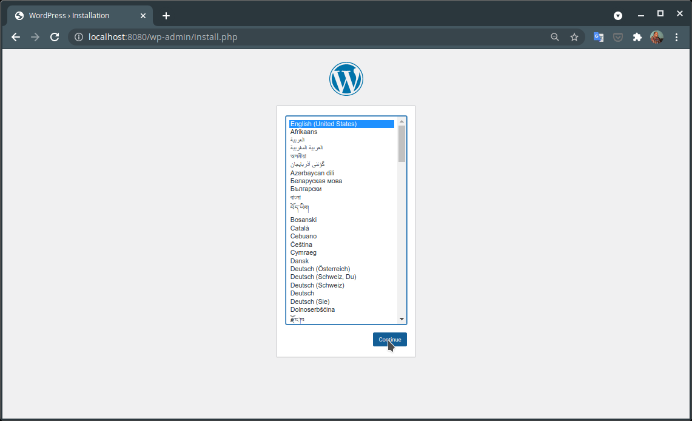

## Pre-requisitos

Cómo es lógico suponer, se requiere tener instalado [Docker](https://www.docker.com/) en nuestro sistema y haber ubicado los directorios que usaremos para almacenar la base de datos y las páginas web, aunque para este fin también podríamos usar volúmenes en lugar de directorios.

## Levantar los servicios

Como hemos visto se requieren dos contenedores, uno para el WordPress con el servidor web y el otro para la base de datos MySQL. Para activarlos, ejecutamos en la línea de comandos las siguientes dos instrucciones, cambiando antes, los valores de los parámetros para que se acomoden los requerimientos de proyecto, tales como nombre de la base de datos, usuario, password y directorios locales para almacenar el proyecto 

```bash
# Contenedor de MySQL
docker run -d --name my-mysql \
-p 3306:3306 \
-e MYSQL_ROOT_PASSWORD=secret \
-e MYSQL_DATABASE=wordpress \
-e MYSQL_USER=wordpress \
-e MYSQL_PASSWORD=wordpress \
-v $HOME/mysql-data:/var/lib/mysql  \
mysql
# Contenedor de WordPress
docker run -d --name wordpress \
-p 8080:80 \
-e WORDPRESS_DB_HOST=192.168.0.107 \
-e WORDPRESS_DB_USER=wordpress \
-e WORDPRESS_DB_NAME=wordpress \
-e WORDPRESS_DB_PASSWORD=wordpress  \
-v $HOME/worpress-data:/var/www/html \
wordpress
  
```

Recuerde que debe cambiar la dirección IP (192.168.0.107) por la dirección del equipo en el entorno local. Observe que usar *localhost* no debería funcionar, ya que se trata de una parámetro que le estamos pasando al contenedor de WordPress, y lo interpretaría como que debe buscar la base de datos dentro de el.

## Comenzar a trabajar

Una vez levantados los servicios podemos comenzar a trabajar accediendo a la dirección local en el puerto especificado:



## Docker Compose

Otra alternativa para levantar nuestra aplicación, que como sabemos requiere de dos componentes, es con el uso de [Docker Compose](https://docs.docker.com/compose/). Esta herramienta viene instalada en la distribución de Docker para Windows y para Mac, pero en Linux es necesario instalarla por separado

## Instalación de Docker Compose

```bash
curl -L https://github.com/docker/compose/releases/download/1.24.0/docker-compose-$(uname -s)-$(uname -m) -o /usr/local/bin/docker-compose
chmod +x /usr/local/bin/docker-compose
# para verificar la instalación
docker-compose -v 
```

## Uso de Docker Compose

Esta herramienta permite la gestión de aplicaciones conformadas por múltiples componentes mediante la definición de un archivo de configuración llamado *docker-compose.yaml*. Note que de esta forma ya no es necesario llevar cuenta de las IPs. En nuestro caso creamos este archivo con el siguiente contenido:

```yaml
version: "3.9"
    
services:
  mysql:
    image: mysql:5.7
    volumes:
      - mysql_data:/var/lib/mysql
    restart: always
    environment:
      MYSQL_ROOT_PASSWORD: sserpdrow
      MYSQL_DATABASE: wordpress
      MYSQL_USER: wordpress
      MYSQL_PASSWORD: wordpress
    ports:
      -"3306:3306"
  phpmyadmin:
    depends_on:
      - mysql
    image: phpmyadmin/phpmyadmin
    environment:
      - PMA_ARBITRARY=1
      - PMA_HOST=mysql:3306
      - PMA_USER=wordpress
      - PMA_PASSWORD=wordpress
    ports:
      -"8000:80" 
  wordpress:
    depends_on:
      - mysql
    image: wordpress:latest
    volumes:
      - wordpress_data:/var/www/html
    restart: always
    environment:
      WORDPRESS_DB_HOST: mysql:3306
      WORDPRESS_DB_USER: wordpress
      WORDPRESS_DB_PASSWORD: wordpress
      WORDPRESS_DB_NAME: wordpress
    ports:
      - "8080:80"
volumes:
  mysql_data: {}
  wordpress_data: {}
```

Como se puede observar, este archivo define la creación de dos contenedores: *mysql*, *phpmyadmin* y *wordpress*. Además para cada uno de ellos define los volúmenes (mysql_data y wordpress_data) que servirán para persistir los cambios, es decir guardar los proyectos que se desarrollen con estas plataformas. De esta manera los contenedores se convierten en entornos desechables ya que lo importante siempre estará almacenado en los volúmenes.

Luego basta iniciar el servicio con la siguiente instrucción:

```bash
docker-compose up -d
```

Para detenerlo se utiliza:

```bash
docker-compose down
```

## Referencias

- [Cómo ejecutar MySQL en un contenedor Docker](https://diarioinforme.com/como-ejecutar-mysql-en-un-contenedor-docker/) 
- [Instalar wordpress usando docker](https://platzi.com/tutoriales/1812-fundamentos-wordpress/4877-instalar-wordpress-usando-docker/) 
- [Cómo usar Docker para desarrollar en WordPress](https://neliosoftware.com/es/blog/como-usar-docker-para-desarrollar-en-wordpress/) 