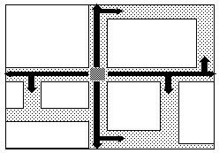
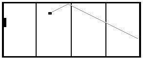

## INTRODUCCIÓN

Además de la capacidad de memorizar otro tipo de computo que ocurre en el sistema nervioso central consiste en aprender reacciones a estímulos. La clase de redes neuronales artificiales que ejecuta este tipo de computo suele diferir radicalmente de los dispositivos de memoria, en particular presentan conexiones sinápticas asimétricas (en algunos casos unidireccionales) lo que impide la aplicación de formalismos de estudio del tipo físico (termodinámica de sistemas en equilibrio) para su estudio. Esta clase de dispositivos suelen denominarse Redes neuronales cibernéticas.

Las redes neuronales a capas pertenecen a la clase de redes cibernéticas y son las mejor estudiadas, aunque no con un enfoque tan general como el de las redes de Hopfield. 

En estas redes la información “fluye” unidireccionalmente desde una capa de entrada constituida por “elementos sensores” hasta otra capa de unidades de procesamiento (UPs), generalmente neuronas motoras, en las cuales se manifiesta la respuesta o salida. En su recorrido la información es procesada parcialmente por diferentes capas intermedias de UPs.

En términos matemáticos puede pensarse que la relación entrada-salida define una correspondencia (relación) y la red neuronal a capas provee una representación de esta correspondencia. Por tal razón suelen también denominarse redes de correspondencias o relaciónales.

En este trabajo nos concentraremos en dos redes neuronales a capas: el perceptron generalizado y la red de funciones de base radial (RBF) estas arquitecturas son suficientemente poderosas para cualquier tarea del tipo considerado, es por esta razón que también son considerados como un aproximador universal de funciones de gran utilidad en problemas no linealmente separables y no lineales en general.

## TOPOLOGÍA DE LA RED

Además consideraremos solo redes de una capa escondida (intermedia) como se ilustra a continuación:

La notación es que los subíndices $i$ se refieren a las salidas, $j$ a capa oculta y $k$ a la entrada. 

Cada capa de estas redes puede tener un numero arbitrario de UPs, estas solo se interconectan con las  UPs de la capa siguiente (no existe interconexión en una misma capa o con  UPs en capas arbitrarias) 

la salida de cada  UP. es conectada a la entrada de cada  UP. en la capa siguiente. Así mismo cada componente del patrón de entrada es comunicado a cada  UP. de la primera capa.

En general la capa de entrada no se cuenta como tal ya que no procesa la información. La única tarea que realiza es la de distribuir el patrón de entrada a todas las unidades de la capa intermedia. Las entradas siempre permanecen ancladas a un valor particular. Estos pueden ser valores binarios, bipolares o reales preferiblemente normalizados.

Como antes, *m* denota a dimensionalidad del patrón de entrada, $n$ la del patrón de salida y $p$ el número de patrones de entrenamiento.

El computo que realizan las  UPs escondidas en el perceptron generalizado es:

$$
V_{j}=f\left(h_{j}^{\mu}\right)=f\left(\sum_{k} w_{j k} x_{k}^{\mu}\right)
$$
mientras que las  UPs de salida:
$$
O_{i}=f\left(\sum_{j} W_{i j} V_{j}\right)
$$
en todos los casos la función de transferencia es o la sigmoide simple (rango entre 0 y 1) o la bipolar (rango entre –1 y 1):

$$
f(x)=\frac{1}{1+\exp (-\alpha x)} \text { o } f(x)=\tanh (x)
$$
Estas funciones tienes las características comunes de ser continuas y derivables para todo x, así mismo mantienen un valor de inactividad (0 ó -1) para los valores de x menores al llamado umbral de activación, alrededor del cual la función crece hasta saturarse en el valor máximo de activación (1). Para obtener la forma bipolar basta con calcula la expresión 2f(x)-1,con f(x) las funciones ya descritas.

El computo que realizan las  UPs escondidas en la red de funciones de base radial es:

$$
V_{j}=f\left(-\sum_{k} \frac{\left(x_{k}^{\mu}-w_{k}\right)^{2}}{2 \sigma^{2}}\right)
$$
mientras que las  UPs de salida:

$$
O_{i}=\sum_{j} W_{i j} V_{j}
$$
la función de transferencia de las  UPs en la capa escondida es típicamente una exponencial conformando una gaussiana (función de base radial):

$$
f(x)=\exp (x)
$$

En todas las expresiones anteriores no se considera explícitamente el umbral que puede incluirse complementando al patrón de entrada con una componente adicional de valor 1 y agregando en la capa intermedia una unidad adicional con actividad constante de uno. Esta modificación no altera el algoritmo pero si incluye en cada capa un nuevo peso que será calculado junto con el resto de los pesos sinápticos y que funge como termino independiente en el argumento de la función de transferencia provocando su desplazamiento horizontal.

## EL ALGORITMO “BACKPROPAGATION”

El algoritmo de aprendizaje en este tipo de redes es supervisado y provee de un método para ajustar los pesos sinápticos de tal forma de que la red sintetize la correspondencia entre los pares de patrones (*x*i,*y*i) en el conjunto de entrenamiento.

El algoritmo de entrenamiento mas popular es el llamado “retropropagacion del error” (error backpropagation) el cual ha sido reinventado una serie de veces por diferentes autores, Brison y Ho en 1969, Werbos en 1974, Parker en 1985, y Rumelhart, Hinton y Williamsen 1986. 

La base de este algoritmo es simplemente el método de descenso de gradiente que se emplea para optimizar una función de calidad de la ejecución de la red. La usada mas comúnmente es:

$$
E(\vec{w})=\frac{1}{2} \sum_{\mu i}\left(y_{i}^{\mu}-O_{i}^{\mu}\right)^{2}
$$
Esta función es evidentemente derivable y por su construcción corresponde a un paraboloide n-dimensional cóncavo hacia arriba, lo cual garantiza geométricamente que tiene mínimo. Un ejemplo de esta estructura geométrica para el caso bidimensional es la siguiente:

Utilizando las expresiones de los cómputos que realizan las  UPs en las redes consideradas podemos escribir las siguientes relaciones para las salidas producidas.

Perceptron:

$$
O_{i}=f\left(\sum_{j} W_{i j} f\left(\sum_{k} w_{j k} x_{k}^{u}\right)\right)
$$
RBF:

$$
O_{i}=\sum_{j} W_{i j} f\left(-\sum_{k} \frac{\left(x_{k}^{\prime \prime}-w_{j k}\right)^{2}}{2 \sigma_{k}^{2}}\right)
$$
En esencia esto es todo lo que hay detrás de la retropropagacion. No obstante la forma que resulta para las expresiones de modificación de los pesos son de gran importancia practica. Sea el perceptron, 

consideremos primero la interconexión entre capa escondida y de salida:

$$
\begin{gathered}
\Delta W_{i j}=-\eta \frac{\partial E}{\partial W_{i j}}=\eta \sum_{\mu}\left(y_{i}^{\mu}-O_{i}^{\mu}\right) f^{\prime}\left(\sum_{j} W_{i j} V_{j}\right) V_{j}^{\mu} \\
=\eta \sum_{\mu} \delta_{i}^{\mu} V_{j}^{\mu}
\end{gathered}
$$
Este resultado es idéntico al del perceptron simple de una sola capa con la salida *v**j* de la capa escondida jugando el papel de patrón de entrada. 

Al considerar a continuación la conectividad capa de entrada - capa escondida se ha de derivar con respecto a $W_{jk}$ variable implícita en el error.

Empleando la regla de la cadena:

$$
\begin{aligned}
&\Delta w_{j k}=-\eta \frac{\partial E}{\partial w_{j k}}=\eta \sum_{\mu} \frac{\partial E}{\partial V_{j}^{\mu}} \frac{\partial V_{j}^{\mu}}{\partial w_{j k}} \\
&=\eta \sum_{\mu}\left(y_{i}^{\mu \prime}-O_{i}^{\mu}\right) f^{\prime}\left(\sum W_{j} V_{i}\right) W_{j} f^{\prime}\left(\sum_{k} w_{\mu} x_{i}^{\mu}\right) x_{k}^{\mu} \\
&=\eta \sum_{\mu i} \delta_{i}^{\mu} W_{i j} f^{\prime}\left(\sum_{k} w_{j k} x_{k}^{\mu}\right) x_{k}^{\mu} \\
&=\eta \sum_{\mu} \delta_{j}^{\mu} x_{k}^{\mu}
\end{aligned}
$$
Donde se ha definido:

Con lo que ambas expresiones para la actualización de los pesos sinápticos tienen la misma forma pero con distintas definiciones de los $\delta_s$.

Por esta razón en la literatura también se encuentra el nombre de regla delta generalizada para este algoritmo de aprendizaje.

Consideremos ahora el mismo calculo pero para la red de RBF. Para la interconexión entre capa escondida y de salida:

$$
\begin{gathered}
\Delta W_{i j}=-\eta \frac{\partial E}{\partial W_{i j}}=\eta \sum_{\mu}\left(y_{i}^{\mu}-O_{i}^{u}\right)\left(\sum_{j} W_{i j} V_{j}\right) V_{j}^{\mu} \\
=\eta \sum_{\mu} \delta_{i}^{\mu} V_{j}^{\mu}
\end{gathered}
$$
Donde se ha definido:

$$
\delta_{i}^{\mu}=\left(\sum_{j} W_{i j} V_{j}\right)\left(y_{i}^{\mu}-O_{i}^{u}\right)
$$
Consideremos ahora el caso de los valores medios en las RBFs gaussianas:

Finalmente el caso de las varianzas $\sigma$ en las RBFs gaussianas:

$$
\Delta \sigma_{k}=-\eta \frac{\partial E}{\partial \sigma_{k}}=\eta \sum_{\mu} \frac{\partial E}{\partial V_{j}^{\mu}} \frac{\partial V_{j}^{\mu}}{\partial \sigma_{k}}
$$
En general es útil emplear constantes de aprendizajes diferentes para cada parámetro. Estas han de determinarse experimentalmente.

$$
\begin{aligned}
\Delta w_{j k}=& \eta_{w} \sum_{\mu i}\left(y_{i}^{\mu}-O_{i}^{\mu}\right)
\left(\frac{\left(x_{k}^{\mu}-w_{j k}\right)}{\sigma_{k}^{2}} W_{i j} \exp \left(-\sum_{h} \frac{\left(x_{h}^{\mu}-w_{j h}\right)^{2}}{2 \sigma_{h}^{2}}\right)\right.\\
\Delta \sigma_{k}=& \eta_{\sigma} \sum_{\mu i}\left(y_{i}^{\mu}-O_{i}^{\mu}\right)
\left(\sum_{h} \frac{\left(x_{k}^{\mu}-w_{h k}\right)^{2}}{\sigma_{k}^{3}} W_{i j} \exp \left(-\sum_{h} \frac{\left(x_{h}^{\mu}-w_{j h}\right)^{2}}{2 \sigma_{h}^{2}}\right)\right.
\end{aligned}
$$
En general con un número arbitrario de capas escondidas el algoritmo de backpropagation siempre actualiza los pesos sinápticos con una regla de la forma:

$$
\Delta W_{p q}=\eta \sum_{\mu} \delta_{\text {salida }}^{\mu} \cdot V_{\text {entrada }}
$$
Donde entrada y salida refieren a las terminaciones $p$ y $q$ correspondientes. Y $V$ refiere a la salida-activación de la capa escondida o entrada real. El significado de $\delta$ depende de la capa que esta siendo tratada.

La ecuación anterior descree la regla de actualización de los pesos sinápticos como una suma sobre todos los patrones de entrenamiento $\mu$. Sin embargo una metodología frecuentemente usada es el entrenamiento incremental en el que se le presenta a la red un patrón a la vez, esto evidentemente disminuye el costo computacional de la función o regla de actualización de pesos en cada paso. Si a la vez los patrones son presentado en un orden aleatorio esto produciría un camino igualmente aleatorio sobre el espacio de los pesos permitiendo así una mayor exploración sobre la superficie de costo o error. La eficiencia relativa de ambas opciones dependerá del problema, sin embargo la experiencia indica que la metodología incremental mejora el entrenamiento en la mayoría de los casos, especialmente en la situaciones donde el conjunto de entrenamiento es muy regular o redundante. 

Como comentario final es útil anotar que al emplear la red de RBF con el algoritmo de aprendizaje de retropropagación del error ha de cuidarse la selección de los valores iniciales de los parámetros. En particular los valores medios han de estar en el rango de valores de la data (hasta es bueno seleccionar algunos patrones de entrada como valores iniciales para estos parámetros) por su parte para los valores iniciales de las varianzas es conveniente seleccionar valores del orden de la varianza de la data o en su defecto valores entre 0.5 y 1 . 

Existen otros esquemas más eficientes para entrenar estas redes de RBF. En general se trata de combinaciones de entrenamiento supervisado para las  UPs de la capa de salida con metodologías no-supervisadas para el entrenamiento de los parámetros de las  UPs de la capa escondida. 

La eficiencia de las redes de RBF radica precisamente en estos esquemas mixtos de entrenamiento que reducen considerablemente su complejidad temporal. Permitiendo una mayor experimentación en la entonación de la red. 

## APLICACIONES DE EJEMPLO.

**LABERINTO**: Entrenaminto de una red neuronal para salir de un laberinto específico.

**FRONTON**: entrenamiento de una RNA para controlar el movimiento de la raqueta en el juego del frontón en 2D y 3D.

**PENDULO INVERTIDO**: entrenamiento de una RNA para controlar el sistema del pendulo invertido

