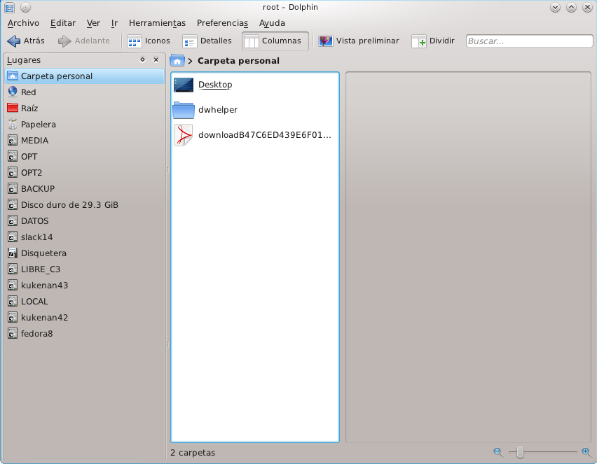

Una forma de resolver esta situación es colocar un Label a estas particiones. Aunque esto no es requerido para el gestor de discos en Linux, generalmente los navegadores de archivos si usan estas etiquetas para identificar la particiones en su interfaz gráfica.

## Formatos EXTx 

La manea de cambiar o asignar un nuevo label o etiqueta a una partición formateada como EXT2, EXT3 o EXT4 es la siguiente:

```bash
tune2fs -L etiqueta /dev/sdxx
```

o también...

```bash
e2label /dev/sdxx etiqueta
```

En donde /dev/sdxx corrsponde al path de la partición que deseamos etiquetar y ETIQUETA corresponde al texto del la etiqueta que deseamos asignarle.

## Formato JFS

Para elcaso de las particiones formateadascon JFS:

```bash
jfs_tune -l etiqueta /dev/sdxx
```


## Formato RaserFS

Para particiones formateadas con RaserFS:

```bash
reiserfstune -l etiqueta /dev/sdxx
```


## Formato XFS

En el caso de XFS podemos renombrar las particiones así:

```bash
xfs_admin -l etiqueta /dev/sdxx
```


## Formato NTFS

En cuanto a las particiones NTFS el comando es el siguiente:

```bash
ntfslabel /dev/sdxx etiqueta
```


## Formato FAT o FAT32 

En cuanto a las particiones de windows FAT, el comando es el siguiente:

```bash
exfatlabel /dev/sdxx etiqueta
```

O también:

```
fatlabel /dev/sdxx etiqueta
```

Estos procedimientos me permitieron etiquetar todas las particiones de mi sistema y así evitar el listados de identificadores numéricos inentendibles en mi navegador de archivos.



## Partición de intercambio (swap)

Para crear o prepara una particion para el swaping con una etiqueta particular:

```bash
mkswap -L etiqueta /dev/sdxx
```

## Automontaje de las particiones

Como deben saber, para automatizar el montaje de nuestras particiones en Linux, es necesario configurar el archivo **/etc/fstab** Cuando este es creado en el proceso de instalación suele identificar los dispositivos a montar por su UUID, pero si queremos utilizar las etiquetas que acabamos de configurar, podemos hacerlo con el siguiente formato:

```bash
LABEL=/LOCAL /usr/local ext3 defaults 1 2
```

 Donde, por ejemplo, LOCAL corresponde a la etiqueta de la partición que deseamos montar en el punto de montaje /usr/local.

## Identificación de las particiones

Para poder hacer todo lo anterior es necesario poder identificar todas las particiones, cuales están montadas y que formato tienen para esto podemos usar algunos comando como:

para listar todas las particiones podemos ejecutar el comando **fdisk** con la opcion **-l**. Si deseamos saber cuales particiones están montada y donde podemos usar el comando **mount** o el comando **df** con la opcion **-h**, este ultimo da información adicional como cuanto espacio tienen y cuanto queda disponible. Otra manea de listar las particiones es con el comando **tree** sobre el directorio **/dev/disks** que da un resultado como el siguiente:

```bash
# tree /dev/disk/
/dev/disk/
|-- by-id
|  |-- ata-LITE-ON_DVDRW_SOHW-1653S -> ../../sr0
|  |-- ata-SAMSUNG_HD753LJ_S13UJ1CS200431 -> ../../sdb
|  |-- ata-SAMSUNG_HD753LJ_S13UJ1CS200431-part1 -> ../../sdb1
|  |-- ata-SAMSUNG_HD753LJ_S13UJ1CS200431-part2 -> ../../sdb2
|  |-- ata-SAMSUNG_HD753LJ_S13UJ1CS200431-part5 -> ../../sdb5
|  |-- ata-SAMSUNG_HD753LJ_S13UJ1CS200431-part6 -> ../../sdb6
|  |-- ata-SAMSUNG_SP1213C_S02AJ10Y426107 -> ../../sdc
|  |-- ata-SAMSUNG_SP1213C_S02AJ10Y426107-part1 -> ../../sdc1
|  |-- ata-SAMSUNG_SP1213C_S02AJ10Y426107-part2 -> ../../sdc2
|  |-- ata-SAMSUNG_SP1213C_S02AJ10Y426107-part3 -> ../../sdc3
|  |-- ata-SAMSUNG_SP1213C_S02AJ10Y426107-part4 -> ../../sdc4
|  |-- ata-WDC_WD1200JS-00MHB0_WD-WCANM3479857 -> ../../sda
|  |-- ata-WDC_WD1200JS-00MHB0_WD-WCANM3479857-part1 -> ../../sda1
|  |-- ata-WDC_WD1200JS-00MHB0_WD-WCANM3479857-part2 -> ../../sda2
|  |-- ata-WDC_WD1200JS-00MHB0_WD-WCANM3479857-part3 -> ../../sda3
|  |-- ata-WDC_WD1200JS-00MHB0_WD-WCANM3479857-part5 -> ../../sda5
|  |-- ata-WDC_WD1200JS-00MHB0_WD-WCANM3479857-part6 -> ../../sda6
|  |-- ata-WDC_WD1200JS-00MHB0_WD-WCANM3479857-part7 -> ../../sda7
|  |-- ata-WDC_WD1200JS-00MHB0_WD-WCANM3479857-part8 -> ../../sda8
|  |-- ata-WDC_WD1200JS-00MHB0_WD-WCANM3479857-part9 -> ../../sda9
|  |-- usb-TSSTcorp_CDDVDW_SE-S084C_SATASLIM0000203fe6e-0:0 -> ../../sr1
|  |-- wwn-0x50024e90010e43d2 -> ../../sdb
|  |-- wwn-0x50024e90010e43d2-part1 -> ../../sdb1
|  |-- wwn-0x50024e90010e43d2-part2 -> ../../sdb2
|  |-- wwn-0x50024e90010e43d2-part5 -> ../../sdb5
|  |-- wwn-0x50024e90010e43d2-part6 -> ../../sdb6
|  |-- wwn-0x50f0000000000000 -> ../../sdc
|  |-- wwn-0x50f0000000000000-part1 -> ../../sdc1
|  |-- wwn-0x50f0000000000000-part2 -> ../../sdc2
|  |-- wwn-0x50f0000000000000-part3 -> ../../sdc3
|  `-- wwn-0x50f0000000000000-part4 -> ../../sdc4
|-- by-label
|  |-- BACKUP -> ../../sdb1
|  |-- DATOS -> ../../sda2
|  |-- LIBRE_C3 -> ../../sdc3
|  |-- LOCAL -> ../../sdb5
|  |-- MEDIA -> ../../sdc4
|  |-- OPT -> ../../sda6
|  |-- OPT2 -> ../../sdb6
|  |-- fedora8 -> ../../sda5
|  |-- kukenan42 -> ../../sda8
|  |-- kukenan43 -> ../../sdc1
|  |-- slack13 -> ../../sda7
|  `-- slack14 -> ../../sdc2
|-- by-path
|  |-- pci-0000:00:1d.7-usb-0:6:1.0-scsi-0:0:0:0 -> ../../sr1
|  |-- pci-0000:00:1f.2-scsi-0:0:0:0 -> ../../sda
|  |-- pci-0000:00:1f.2-scsi-0:0:0:0-part1 -> ../../sda1
|  |-- pci-0000:00:1f.2-scsi-0:0:0:0-part2 -> ../../sda2
|  |-- pci-0000:00:1f.2-scsi-0:0:0:0-part3 -> ../../sda3
|  |-- pci-0000:00:1f.2-scsi-0:0:0:0-part5 -> ../../sda5
|  |-- pci-0000:00:1f.2-scsi-0:0:0:0-part6 -> ../../sda6
|  |-- pci-0000:00:1f.2-scsi-0:0:0:0-part7 -> ../../sda7
|  |-- pci-0000:00:1f.2-scsi-0:0:0:0-part8 -> ../../sda8
|  |-- pci-0000:00:1f.2-scsi-0:0:0:0-part9 -> ../../sda9
|  |-- pci-0000:00:1f.2-scsi-1:0:0:0 -> ../../sdb
|  |-- pci-0000:00:1f.2-scsi-1:0:0:0-part1 -> ../../sdb1
|  |-- pci-0000:00:1f.2-scsi-1:0:0:0-part2 -> ../../sdb2
|  |-- pci-0000:00:1f.2-scsi-1:0:0:0-part5 -> ../../sdb5
|  |-- pci-0000:00:1f.2-scsi-1:0:0:0-part6 -> ../../sdb6
|  |-- pci-0000:00:1f.5-scsi-0:0:0:0 -> ../../sdc
|  |-- pci-0000:00:1f.5-scsi-0:0:0:0-part1 -> ../../sdc1
|  |-- pci-0000:00:1f.5-scsi-0:0:0:0-part2 -> ../../sdc2
|  |-- pci-0000:00:1f.5-scsi-0:0:0:0-part3 -> ../../sdc3
|  |-- pci-0000:00:1f.5-scsi-0:0:0:0-part4 -> ../../sdc4
|  `-- pci-0000:03:00.0-scsi-0:0:0:0 -> ../../sr0
`-- by-uuid
  |-- 05c2741b-ba40-4e2d-ab76-81a81fab7cda -> ../../sdc4
  |-- 15bc33aa-18f3-420c-8994-0a135ada26e3 -> ../../sdb6
  |-- 18DE-A71C -> ../../sda2
  |-- 3be461c8-f6cd-4c4a-a77f-8970a9f1892c -> ../../sdc3
  |-- 5C247DF4247DD18E -> ../../sda1
  |-- 5d39ae0a-cad6-4a0a-9ad1-eb583c6cc2a8 -> ../../sda8
  |-- 63190f5d-6a45-45f2-a028-7d481928e40b -> ../../sda5
  |-- 6c652e3e-3e2d-4bd6-94d5-20b3531424d5 -> ../../sda9
  |-- 725c8ad4-832a-45a8-a441-ed5d218dabe6 -> ../../sdc1
  |-- bb3d0633-25c6-46e6-9d9e-7b48805848d2 -> ../../sdc2
  |-- bd4a028d-47d7-4e33-8d22-e2b2725e57c7 -> ../../sda6
  |-- c03a0ecb-7dec-4c78-8c0a-61add968a93b -> ../../sda7
  |-- c190c3a0-fd07-4339-bc8a-0822c5eeb2a9 -> ../../sdb5
  `-- c6c3b5be-7c69-4a32-8fe7-8b56279cdc0e -> ../../sdb1
```

Como pueden ver este directorio contiene varios sub-directorios donde se listan todas las particiones por identificador del disco, etiquetas, dirección física del dispositivo y UUID.

## Otras utilidades

###### Algunas utilidades / comandos de Linux que son útiles para las operaciones relacionadas con el sistema de archivos incluyen:

1. [**fdisk**](https://www.tecmint.com/fdisk-commands-to-manage-linux-disk-partitions/) : para crear, modificar, eliminar particiones, incluida la creación e impresión de tablas de particiones, etc.
2. **parted** : realiza las mismas operaciones que fdisk e incluso muchas más.
3. [**df**](https://www.tecmint.com/how-to-check-disk-space-in-linux/) : muestra todos los sistemas de archivos montados en el sistema de archivos de Linux y sus puntos de montaje.
4. [**mount**](https://www.tecmint.com/mount-filesystem-in-linux/) : para montar sistemas de archivos, directorios, cambiar el punto de montaje de un directorio / dispositivo y todo tipo de operaciones de este tipo.
5. **mkfs** : creación y formato de un sistema de archivos. Por lo general, el comando se usa en concatenación con el tipo de formato deseado. Me gusta: mkfs.ext4 para formatear el sistema de archivos con el tipo ext4.
6. **umount** : para desmontar el sistema de archivos de una partición.
7. **GParted / QParted** - GUI Parted para sistemas Gnome y KDE.
8. **Disks** : utilidad de software preinstalada en sistemas Linux para administrar particiones a través de GUI.

## Fuentes

https://www.tecmint.com/change-modify-linux-disk-partition-label-names/

https://www.monkey-mind.net/software/fatlabel/fatlabel.htm


