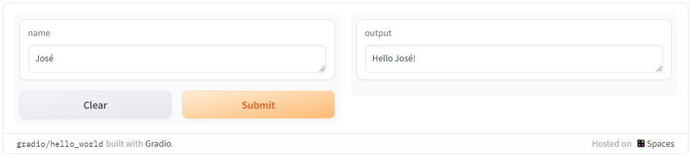

[Gradio](https://www.gradio.app/) es un librería de Python para el desarrollo rápido de aplicaciones orientada a uso de Machine Learning y Generative AI. En este post solo busco hacer un pequeña demostración de como podemos levantar un chat web que sirva como interface grafica a un modelo local gestionado por [Ollama](https://github.com/). 


## Instalación de Gradio

Gradio se puede instalar con pip. 

```bash
pip install gradio
```

Podemos utilizar sin problemas cualquier biblioteca de Python o escribir una función de Python, y gradio puede ejecutarla. Crear una interfaz Gradio solo requiere agregar un par de líneas de código a nuestro proyecto, por ejemplo:

```python
import gradio as gr

def greet(name):
    return "Hello " + name + "!"

demo = gr.Interface(fn=greet, inputs="text", outputs="text")
demo.launch() 
```

Generará la siguiente interface localmente:  [http://localhost:7860](http://localhost:7860/) :



## Compartir nuestras demos

Gradio puede integrarse en cuadernos de Python o presentarse como una página web. Una interfaz de Gradio puede generar automáticamente un enlace público que podemos compartir a través de Internet y que permite interactuar con un modelo de Ia desde nuestra computadora de forma remota desde sus propios dispositivos (al estilo [Ngrok](https://ngrok.com/)).

## Un Chat de IA Generativa "Local"

A continuación el código Python de nuestro chat de pruebas:

```python
import requests
import json
import gradio as gr

url = "http://localhost:11434/api/generate"

headers = {
    'Content-Type': 'application/json',
}

conversation_history = []

def generate_response(prompt):
    conversation_history.append(prompt)

    full_prompt = "\n".join(conversation_history)

    data = {
        "model": "mistral",
        "stream": False,
        "prompt": full_prompt,
    }

    response = requests.post(url, headers=headers, data=json.dumps(data))

    if response.status_code == 200:
        response_text = response.text
        data = json.loads(response_text)
        actual_response = data["response"]
        conversation_history.append(actual_response)
        return actual_response
    else:
        print("Error:", response.status_code, response.text)
        return None

iface = gr.Interface(
    fn=generate_response,
    inputs=gr.inputs.Textbox(lines=2, placeholder="Enter your prompt here..."),
    outputs="text"
)

iface.launch()
```

Es importante recordar que si corremos este código desde un contenedor, de [Jupyter](https://jupyter-docker-stacks.readthedocs.io/en/latest/using/selecting.html) por ejemplo, deberemos sustituir el URL del servicio de Ollama, de `http://localhost:11434` a `http://host.docker.internal:11434`.

## Hosting permanente

Una vez que haya creado una interfaz, esta puede ser alojada de forma permanentemente en Hugging Face. Hugging Face Spaces alojará la interfaz en sus servidores y nos proporcionará un enlace que se puede compartir.


