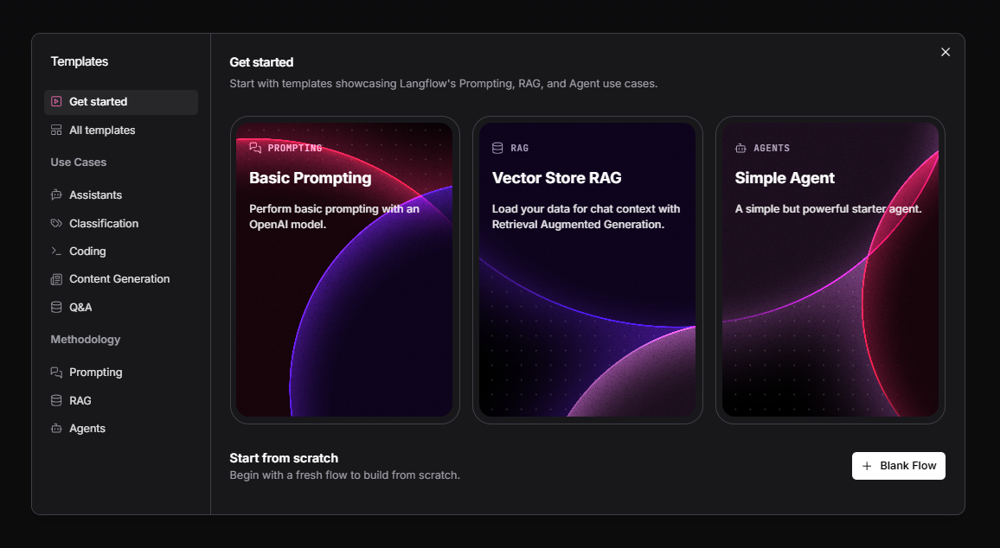
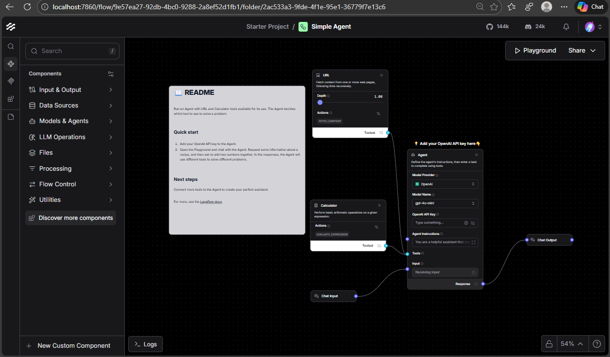

## Iniciar el servicio

Levantar el servicio de Lanflow en docker con:

```bash
docker run -p 7860:7860 langflowai/langflow:latest
...
✓ Launching Langflow...
╭─────────────────────────────────────────────────────────────────────────╮
│                                                                         │
│  Welcome to Langflow                                                    │
│                                                                         │
│  🌟 GitHub: Star for updates → https://github.com/langflow-ai/langflow  │
│  💬 Discord: Join for support → https://discord.com/invite/EqksyE2EX9   │
│                                                                         │
│  We collect anonymous usage data to improve Langflow.                   │
│  To opt out, set: DO_NOT_TRACK=true in your environment.                │
│                                                                         │
│  🟢 Open Langflow → http://localhost:7860                               │
│                                                                         │
╰─────────────────────────────────────────────────────────────────────────╯
```


## Acceder a LangFlow

Para abrir la consola de LangFlow en el browser ir a: http://localhost:7860/
La primera vez se verá una pantalla con algunas opciones para iniciar:


Si escojemos un agente de IA:




## Documentación

- https://docs.langflow.org/deployment-docker
- https://docs.langflow.org/bundles-groq


## Videos
- [LangFlow Tutorial #1: Build AI-Powered Apps without Coding!](https://www.youtube.com/watch?v=sC9SV06gsDM) 
- [Building no-code low-code RAG Application Using LangFlow](https://www.youtube.com/watch?v=xPq9MPXWIRo) 
- [Langflow Tutorial: Build No-Code AI Agents and RAGs](https://www.youtube.com/watch?v=qaEVUhoKS8M) 
