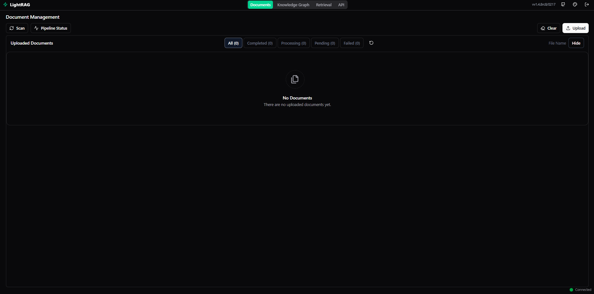

## Arquitectura de LightRAG


## Requisitos previos

Tener instalado **Docker** (y opcionalmente **Docker Compose**).  
Verifica:

```bash
docker --version
docker compose version   # (o `docker-compose --version` en instalaciones antiguas)
```

Descarga de la imagen docker y creámo el volumen para la persistencia de los datos:

```
docker volume create lightrag 
docker pull ghcr.io/hkuds/lightrag:latest
```

## Levantar el servicio - Modelos OpenAI

Para activar el servicio invocaremos el siguiente comando:

```
docker run -d \
	--env=AUTH_ACCOUNTS=admin:kukenan,jose:oicicreje \
	--env=TOKEN_SECRET=BnzCYNwdMDtpoBWYnLv8 \
	--env=LIGHTRAG_API_KEY=APIKEY_LIGHTRAG  \
	--env=LLM_BINDING=openai \
	--env=LLM_BINDING_HOST=https://api.openai.com/v1 \
	--env=LLM_MODEL=gpt-4.1-nano \
	--env=LLM_BINDING_API_KEY=OPENAI_API_KEY  \
	--env=LLM_BINDING_API_KEY=APIKEY_OPENAI  \
	--env=OPENAI_LLM_MAX_TOKENS=9000  \
	--env=EMBEDDING_BINDING=openai  \
	--env=EMBEDDING_BINDING_HOST=https://api.openai.com/v1  \
	--env=EMBEDDING_MODEL=text-embedding-3-small  \
	--env=EMBEDDING_DIM=1536  \
	--env=EMBEDDING_BINDING_API_KEY=OPENAI_API_KEY  \
	--env=EMBEDDING_BINDING_API_KEY=APIKEY_OPENAI  \
	--env=MAX_ASYNC=12 \
	--env=MAX_PARALLEL_INSERT=3 \
	--env=EMBEDDING_FUNC_MAX_ASYNC=24 \
	--env=EMBEDDING_BATCH_NUM=100 \
	--env=LIGHTRAG_KV_STORAGE=JsonKVStorage  \
	--env=LIGHTRAG_DOC_STATUS_STORAGE=JsonDocStatusStorage  \
	--env=LIGHTRAG_GRAPH_STORAGE=NetworkXStorage  \
	--env=LIGHTRAG_VECTOR_STORAGE=NanoVectorDBStorage  \
	--env=SUMMARY_LANGUAGE=Spanish \
	--env=GPG_KEY=GPG_KEY  \
	--env=PYTHON_VERSION=3.12.11  \
	--env=PYTHON_SHA256=PYTHON_KEY  \
	--env=WORKING_DIR=/app/data/rag_storage  \
	--env=INPUT_DIR=/app/data/inputs  \
	--network=bridge  \
	--workdir=/app  \
	--name lightrag \
	-p 9621:9621  \
	-v lightrag_data:/app/data \
	--restart=no  \
	--runtime=runc  \
	ghcr.io/hkuds/lightrag:latest
```

## Levantar el servicio - Modelos Locales
Para activar el servicio invocaremos el siguiente comando:

```
docker run -d \
	--env=AUTH_ACCOUNTS=admin:kukenan,jose:oicicreje \
	--env=TOKEN_SECRET=BnzCYNwdMDtpoBWYnLv8 \
	--env=LLM_BINDING=openai \
	--env=LLM_MODEL=gpt-4o-mini \
	--env=LLM_BINDING_API_KEY=OPENAI_API_KEY  \
	--env=LLM_BINDING_API_KEYAPIKEY_OPENAI  \
	--env=OPENAI_LLM_MAX_TOKENS=9000  \
	--env=LLM_BINDING_HOST=https://api.openai.com/v1 \
	--env=EMBEDDING_BINDING=openai  \
	--env=EMBEDDING_BINDING=openai  \
	--env=EMBEDDING_MODEL=text-embedding-3-small  \
	--env=EMBEDDING_DIM=1536  \
	--env=EMBEDDING_BINDING_HOST=https://api.openai.com/v1  \
	--env=EMBEDDING_BINDING_API_KEY=OPENAI_API_KEY  \
	--env=EMBEDDING_BINDING_API_KEY=APIKEY_OPENAI  \
	--env=LIGHTRAG_KV_STORAGE=JsonKVStorage  \
	--env=LIGHTRAG_DOC_STATUS_STORAGE=JsonDocStatusStorage  \
	--env=LIGHTRAG_GRAPH_STORAGE=NetworkXStorage  \
	--env=LIGHTRAG_VECTOR_STORAGE=NanoVectorDBStorage  \
	--env=SUMMARY_LANGUAGE=Spanish \
	--env=GPG_KEY=GPG_KEY  \
	--env=PYTHON_VERSION=3.12.11  \
	--env=PYTHON_SHA256=PYTHON_KEY  \
	--env=WORKING_DIR=/app/data/rag_storage  \
	--env=INPUT_DIR=/app/data/inputs  \
	--network=bridge  \
	--workdir=/app  \
	-p 9621:9621  \
	--restart=no  \
	--runtime=runc  \
	ghcr.io/hkuds/lightrag:latest
```


## Interface de usuario (GUI)




Fuentes:

- [HKUDS/LightRAG: "LightRAG: Simple and Fast Retrieval-Augmented Generation"](https://github.com/HKUDS/LightRAG)
- [Package lightrag](https://github.com/HKUDS/LightRAG/pkgs/container/lightrag) 
- Tutorial LightRAG: [Simple and Fast Alternative to GraphRAG for Legal Doc Analysis]((https://learnopencv.com/lightrag/) 
- [Make your AI Agents 10x Smarter with GraphRAG (n8n)](https://www.youtube.com/watch?v=EUG65dIY-2k) de [The AI Automators](https://www.youtube.com/@TheAIAutomators)

