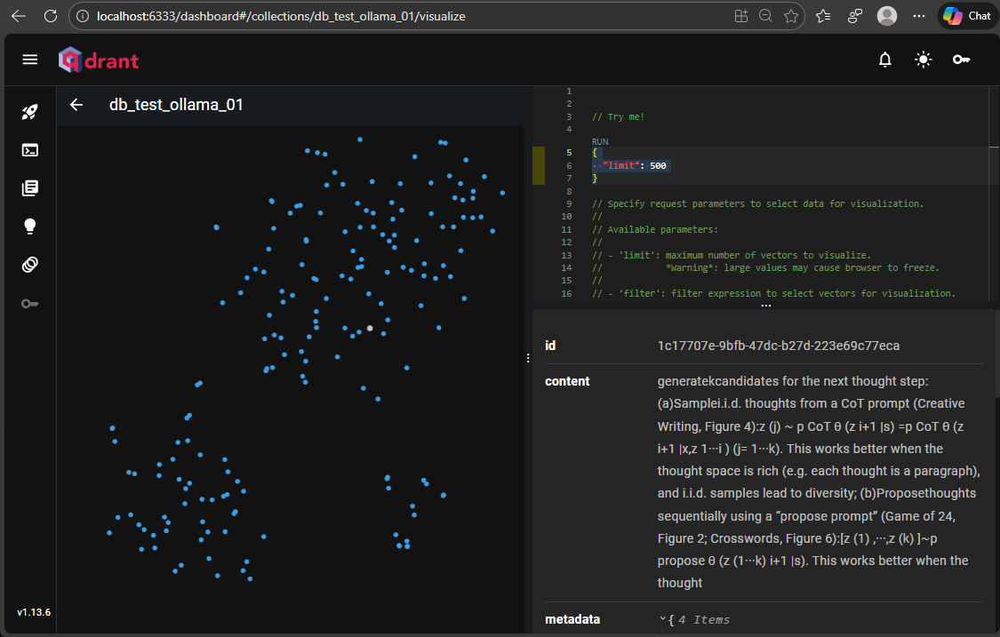
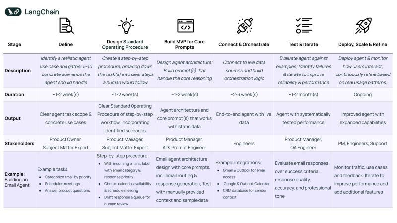

**Qdrant** es una herramienta fundamental para la inteligencia artificial moderna, especialmente en sistemas de **Generación Aumentada por Recuperación (RAG)** y motores de recomendación.
### Fuentes:
- [Imagen Docker de Qdrant](https://hub.docker.com/r/qdrant/qdrant) 
- [Guía de instalación]([Installation - Qdrant](https://qdrant.tech/documentation/guides/installation/)) 
- [Video Install and Run Qdrant Vector Database on Docker](https://www.youtube.com/watch?v=G0qmO2iqx5M) 
- [The Top 7 Vector Databases in 2025](https://www.datacamp.com/blog/the-top-5-vector-databases) 

### Acceso desde Python

```bash
pip install qdrant-client
```

El cliente de Python ofrece una forma conveniente de comenzar con Qdrant localmente:

```python
from qdrant_client import QdrantClient
qdrant = QdrantClient(":memory:") # Create in-memory Qdrant instance, for testing, CI/CD
# OR
client = QdrantClient(path="path/to/db")  # Persists changes to disk, fast prototyping
```

### Cliente-Servidor

Para experimentar todo el poder de Qdrant localmente, ejecute el contenedor con este comando:

```bash
docker volume create qdrant_data 
docker run -d -p 6333:6333 \
	--name qdrant \
	-e QDRANT__SERVICE__API_KEY="kukenan" \
	--restart=always \
    -v qdrant_data:/qdrant/storage \
    qdrant/qdrant
```

Para acceder a la app de Qdrand, abrimor en cualquier browser: http://localhost:6333/dashboard


De esta manera podemos tener mas control del volumen de datos generados para posibles respaldos en el futuro. Ahora podemos acceder al servicio en la siguiente dirección local:

```
curl -X GET http://localhost:6333 --header 'api-key: kukenan'
```


Ahora puedes conectarte a esto con cualquier cliente, incluido Python:

```python
qdrant = QdrantClient("http://localhost:6333") # Connect to existing Qdrant instance
```

Antes de implementar Qdrant en producción, asegúrese de leer nuestras [guías](https://qdrant.tech/documentation/guides/security/) [de](https://qdrant.tech/documentation/guides/installation/) [instalación](https://qdrant.tech/documentation/guides/installation/) y [seguridad](https://qdrant.tech/documentation/guides/security/) 

Cuadro comparativo de bases de datos vectoriales:


