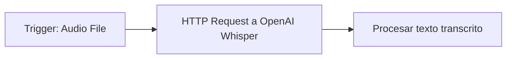
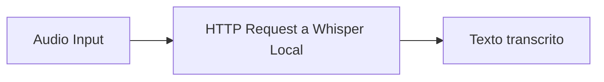

## Opciones para STT con Whisper en n8n

### OpenAI Whisper API (Método más sencillo)

**Flujo básico:**
1. **Trigger**: Recibir audio (por ejemplo, de Telegram, Email, Google Drive, etc.)
2. **HTTP Request Node**: Enviar audio a OpenAI Whisper API
3. **Procesar respuesta**: Usar el texto transcrito

**Configuración del HTTP Request Node:**
- **Method**: POST
- **URL**: `https://api.openai.com/v1/audio/transcriptions`
- **Authentication**: Bearer Token (tu API key de OpenAI)
- **Content-Type**: `multipart/form-data`
- **Body Parameters**:
  - `file`: El archivo de audio
  - `model`: `whisper-1`

### Whisper Autoinstalado (Self-hosted)

Si prefieres no depender de OpenAI, puedes usar una versión autohospedada de Whisper:

### Usando servicios alternativos

- **AssemblyAI**
- **Google Speech-to-Text**
- **Azure Speech Services**
- **Hugging Face APIs**

## Ejemplo completo: Telegram + Whisper

**Caso de uso**: Recibir audio por Telegram y transcribirlo con Whisper

### Flujo en n8n:

1. **Telegram Trigger**: *On Message Received*
2. **Filter Node**: Filtrar solo mensajes con audio
3. **HTTP Request**: Descargar el archivo de audio de Telegram
4. **HTTP Request**: Enviar audio a OpenAI Whisper API
5. **Telegram**: Enviar el texto transcrito como respuesta

### Configuración detallada:

**Nodo 1: Telegram Trigger**
- Event: `message`
- Filtros adicionales para detectar archivos de audio

**Nodo 2: HTTP Request (Descargar audio)**
- Method: `GET`
- URL:
`https://api.telegram.org/bot{token}/getFile?file_id={{$json["message"]["audio"]["file_id"]}}`

**Nodo 3: HTTP Request (Whisper API)**
- Method: `POST`
- URL: `https://api.openai.com/v1/audio/transcriptions`
- Headers:
  - `Authorization`: `Bearer YOUR_OPENAI_API_KEY`
- Body: `multipart/form-data`
  - `file`: Binary data del audio
  - `model`: `whisper-1`

## Consideraciones importantes:

- **Formatos de audio**: Whisper acepta: MP3, MP4, M4A, WAV, MPEG, MPGA, WEBM, FLAC
- **Tamaño máximo**: 25MB para OpenAI API
- **Costos**: Cada minuto transcrito tiene un costo en OpenAI

